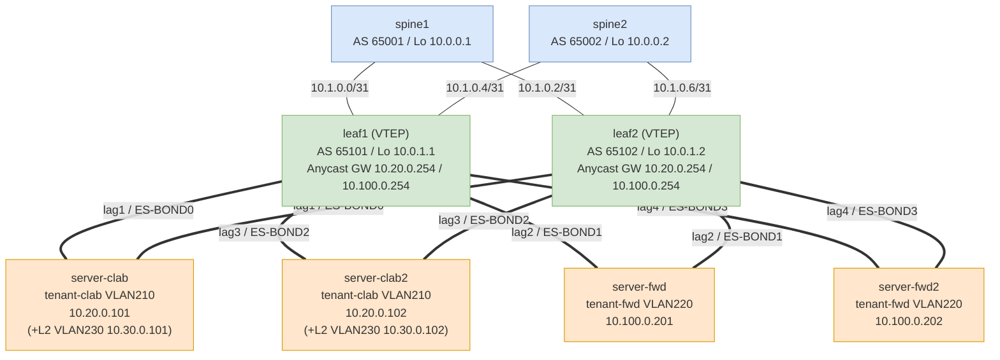

# ContainerLab BGP EVPN-VXLAN 検証環境 構築ガイド

> 対象設計書: Proxmox VEを中心とした仮想化基盤構築 全体アーキテクチャ設計書 v1.4  
> 検証環境: Ubuntu 24.04 on VMware Workstation  
> SR-Linux: Spine×2 / Leaf×2 / BGP EVPN-VXLAN / ESI-LAG All-Active / Route-leak比較  
> ContainerLab: v0.76.0 / SR-Linux: 26.3.2

### 変更履歴

| 版 | 変更内容 |
|---|---|
| v2.9 | Section 1 トポロジー図を刷新 (2026-06-13) |
| | leaf が4回再掲され分かりにくかった図を Mermaid 図 + ASCII 版に置換 |
| | 各ノードを1回ずつ表示・ESI-LAG 二重接続を明示・VLAN230 (proxy-ARP) も反映 |
| | P2Pリンク / アクセスポートを表形式に整理 (図=構造・表=詳細に分離) |
| v2.8 | BFD / Graceful Restart 障害挙動検証を追加 (2026-06-13) |
| | Section 16 新規: BFD と GR の関係・効果測定 (A/B/C 比較) |
| | 実測: リンク断は BFD で再収束 (無効時は障害区間全断)、|
| | 単一経路の bgp_mgr 再起動は GR なし97%損失 → GRあり0.35%損失 |
| | **重要**: ECMP+GR で本物のリンク障害を入れると死路が stale 保持され |
| | ブラックホール化 (76%損失) → GR は configs から削除し無効が結論 |
| | 知見: ContainerLab の BFD は 1s にクランプ (実機は設定どおり300ms) |
| | 知見: GR ヘルパーは BFD 起因のセッション断でも stale 保持して再収束を妨げる |
| v2.7 | Proxy-ARP (ARP Suppression) 検証追加 (2026-06-13) |
| | Section 15 新規: メリット・効果測定方法 (A/B 比較)・実測結果 |
| | L2専用ドメイン追加: VLAN 230 / VNI 50040 / mac-vrf-l2 (leaf1/leaf2, server-clab/clab2) |
| | 制約判明: IRB 付き mac-vrf には proxy-arp 設定不可 (7220 D2L、コミット拒否) |
| | 実測: リモートサーバ着信 ARP 4パケット → 0 (疎通影響なし) |
| v2.6 | イメージピン止め・eBGPデフォルトポリシー設計見直し (2026-06-13) |
| | topology: srlinux `latest` → `26.3.2`、network-multitool → digest 固定 |
| | 全ノード: `ebgp-default-policy import/export-reject-all false` を削除 |
| | (全グループ・afi-safi に明示ポリシーがあるため RFC 8212 デフォルトに戻す) |
| | 変更後の再デプロイで End-to-End 全疎通・ESI-LAG ×4 Up・VRF間分離を再確認 |
| v2.5 | ContainerLab 0.76.0 / SR-Linux 26.3.2 で再検証 (2026-06-13) |
| | コンフィグ変更なしで全機能動作確認 |
| | Underlay eBGP+BFD / EVPN / ESI-LAG All-Active ×4 全て正常 |
| | End-to-End 疎通確認: Anycast GW・IRB 個別アドレス・サーバ間 (両テナント) 全疎通 |
| | VRF 間分離 (route-leak なし時の不通) も期待どおり動作 |
| v2.4 | MTU 設計詳細化 |
| | Section 14.3: Interface MTU / IP MTU の違いを説明追加 |
| | Section 14.3: VLAN tag オーバーヘッド考慮した MTU スタック詳細化 |
| | Section 14.4: P2P (9214) / LAG VLAN (9210) / IRB (9000) の設定値を明確化 |
| | Section 14.5: Proxmox bond0/VLAN MTU 設定を詳細化 (bond0: 9000, bond0.210: 8996) |
| v2.3 | Proxmox 物理環境向け設定追加・デバッグコマンド修正 |
| | Section 13.2: VXLAN デバッグコマンド修正 |
| | Section 13.2: ARP テーブル・LAG 確認コマンド追加 |
| | Section 14 新規: Proxmox (Debian) Bonding/VLAN/MTU 設定手順 |
| | MTU スタック設計 (物理 9000 → Pod 8850) を記載 |
| v2.2 | サーバ追加・802.1q VLAN tagging 対応 |
| | server-clab2 (10.20.0.102/VLAN210/lag3/ES-BOND2) 追加 |
| | server-fwd2 (10.100.0.202/VLAN220/lag4/ES-BOND3) 追加 |
| | leaf1/leaf2: lag3/lag4 + ESI-BOND2/BOND3 追加 |
| | mac-vrf-clab: lag3.210 追加 / mac-vrf-fwd: lag4.220 追加 |
| v2.1 | 802.1q VLAN tagging 対応 |
| | lag1: untagged → VLAN 210 (single-tagged) に変更 |
| | lag2: untagged → VLAN 220 (single-tagged) に変更 |
| | mac-vrf-clab: lag1.0 → lag1.210 に変更 |
| | mac-vrf-fwd: lag2.0 → lag2.220 に変更 |
| | server-clab: bond0 → bond0.210 (VLAN サブインターフェース) に変更 |
| | server-fwd: bond0 → bond0.220 (VLAN サブインターフェース) に変更 |
| v2.0 | ARP population 設定追加・Anycast GW + Type-2 MAC+IP 広告を完全動作確認 |
| | leaf1/leaf2 irb0.210/220 に ARP population 設定追加 (Symmetric IRB必須) |
| | `learn-unsolicited true` / `host-route populate dynamic` / `evpn advertise dynamic` |
| | `advertise-arp-nd-only-with-mac-table-entry false` を削除 (不要と判明) |
| | End-to-End 疎通確認: server-clab/fwd → 各 IRB 個別アドレス・Anycast GW 全疎通 |
| v1.9 | server-fwd ESI-LAG化・Anycast GW追加 |
| | server-fwd: bonding (lag2/ESI-BOND1) 対応 |
| | server-clab/fwd: デフォルトGWを Anycast GW アドレスに変更 |
| | leaf1/leaf2: ethernet-1/4 → lag2 メンバーに変更 |
| | leaf1/leaf2: ES-BOND1 (ESI: 00:11:22:33:44:55:66:77:88:02) 追加 |
| | leaf1/leaf2: irb0.210/220 に Anycast GW 追加 (VRID=1/2) |
| | トポロジー図更新 (lag2/Anycast GW反映) |
| v1.8 | ESI-LAG 検証完了 |
| | topology.yaml: `cap-add` (NET_ADMIN/SYS_ADMIN/NET_RAW) 追加 |
| | topology.yaml: `bash -c "ip link set ethX down && ip link set ethX master bond0"` で bonding 動作確認 |
| | leaf1/leaf2: ethernet-1/3 直結 → lag1 メンバーに戻す |
| | leaf1/leaf2: ESI-LAG system evpn ethernet-segments 設定を有効化 |
| | ESI-LAG All-Active 動作確認: Type-1/2/3/4/5 全 Route Type 正常動作 |
| | DF 選出確認: leaf1 (10.0.1.1) が DF、leaf2 (10.0.1.2) がバックアップ |
| v1.7 | ECMP 設定追加 |
| | leaf1/leaf2 に BGP eBGP multipath 設定追加 |
| | `multipath allow-multiple-as true` + `ebgp maximum-paths 2` |
| v1.6 | Route-leak あり/なし 検証完了 |
| | 11.6 実機検証結果セクション追加 (SR-Linux 25.10.1) |
| | 双方向疎通・TTL・ルートテーブル変化を記録 |
| v1.5 | 実機検証完了・End-to-End疎通確認済み |
| | spine1/spine2 に `inter-as-vpn true` 追加 (RT未マッチEVPNルートのリレーに必須) |
| | spine2 の `network-instance default` へ ethernet-1/1.0, ethernet-1/2.0 追加 |
| | leaf1/leaf2: lag1 → ethernet-1/3 直結に変更 (ContainerLabではbonding不可) |
| | leaf1/leaf2: ESI-LAG設定をコメントアウト (物理環境用として残置) |
| v1.4 | SR-Linux 25.10.1 実機検証ベースで追加修正 |
| | EVPN-EXPORT/EVPN-IMPORT ポリシー追加 (全ノード必須) |
| | afi-safi evpn レベルへの export/import-policy 設定 (全ノード) |
| | mac-vrf に irb0.210/220 をアタッチ (leaf1/leaf2) |
| | bgp-evpn に inclusive-mcast / mac-ip advertise 設定追加 (leaf1/leaf2) |
| | leaf2 tenant-clab-vrf の RD バグ修正 (10.0.1.1 → 10.0.1.2) |
| | running config 保存手順を追加 |
| v1.3 | SR-Linux 25.10.1 実機検証ベースで追加修正 |
| | `tunnel-interface vxlan0 admin-state enable` 削除 (25.xでは不要) |
| | `export-policy` / `import-policy` のポリシー名を `[NAME]` 形式に修正 (全ノード) |
| v1.2 | SR-Linux 25.10.1 実機検証ベースで追加修正 |
| | BGP グローバル afi-safi 追加 (全ノード必須) |
| | `next-hop-unchanged true` 削除 (25.xではデフォルト動作、設定不要) |
| | `egress source-ip system-ipv4` → `use-system-ipv4-address` |
| | `destination-mac-field lookup` 削除 (25.xでは廃止、mac-vrfが自動解決) |
| | ノードタイプ名: `ixrd3l/ixrd2l` → `ixr-d3l/ixr-d2l` |
| | routing-policy: `match prefix-set` → `match prefix prefix-set` |
| | LAG: `lag-type lacp` の位置修正・`lacp-rate` → `lag lacp interval FAST` |
| | LAG: `system-id` → `lacp system-id-mac` / `admin-key` → `lacp admin-key` |
| | server-clab: bonding 削除 (ContainerLab 0.73+ でNET_ADMIN権限付与不可) |
| | server: `ip route add` → `ip route replace` / resolv.conf を `bash -c` でラップ |

---

## 目次

1. [検証トポロジー概要](#1-検証トポロジー概要)
2. [前提条件・インストール](#2-前提条件インストール)
3. [ディレクトリ構成](#3-ディレクトリ構成)
4. [ContainerLab Topology定義](#4-containerlab-topology定義)
5. [SR-Linux 設定ファイル](#5-sr-linux-設定ファイル)
   - [Spine-1 (D3L-1)](#51-spine-1-d3l-1--as-65001)
   - [Spine-2 (D3L-2)](#52-spine-2-d3l-2--as-65002)
   - [Leaf-1 (D2L-1)](#53-leaf-1-d2l-1--as-65101)
   - [Leaf-2 (D2L-2)](#54-leaf-2-d2l-2--as-65102)
6. [サーバー・VRF設定スクリプト](#6-サーバーvrf設定スクリプト)
7. [起動手順](#7-起動手順)
8. [確認手順 (Underlay)](#8-確認手順-underlay)
9. [確認手順 (Overlay EVPN)](#9-確認手順-overlay-evpn)
10. [ESI-LAG All-Active 検証](#10-esi-lag-all-active-検証)
11. [Route-leak あり/なし 比較検証](#11-route-leak-ありなし-比較検証)
12. [障害シナリオテスト](#12-障害シナリオテスト)
13. [トラブルシューティング](#13-トラブルシューティング)
    - [13.5 Running Config の保存](#135-running-config-の保存)
14. [Proxmox (Debian) 物理環境向け設定手順](#14-proxmox-debian-物理環境向け設定手順)
15. [Proxy-ARP (ARP Suppression) 検証](#15-proxy-arp-arp-suppression-検証)
16. [BFD と Graceful Restart の障害挙動検証](#16-bfd-と-graceful-restart-の障害挙動検証)

---

## 1. 検証トポロジー概要

各ノードは1回ずつ登場し、ESI-LAG の二重接続 (各サーバ → leaf1/leaf2) を太線で表す。
Mermaid 対応ビューア (GitHub / VS Code 等) では下図がそのまま描画される。



Mermaid 非対応ビューア向けの ASCII 版 (Leaf を 2 本のレールとして描き、各サーバが両 Leaf に接続することを示す):

```
=====================  Fabric (eBGP underlay + EVPN overlay, 全リンク BFD)  =====================

        spine1                                                   spine2
       AS 65001                                                 AS 65002
      Lo 10.0.0.1                                              Lo 10.0.0.2
          │ │                                                      │ │
          │ └────────────── 10.1.0.2/31 ────────────┐             │ │
   10.1.0.0/31                                       │      10.1.0.6/31
          │         ┌──────── 10.1.0.4/31 ───────────┼─────────────┘ │
          │         │ (フルメッシュ: 各 Leaf は両 Spine へ)            │
        leaf1 ◀─────┘                                 └───────────▶ leaf2
       AS 65101                                                 AS 65102
      Lo 10.0.1.1  VTEP                                        Lo 10.0.1.2  VTEP
      Anycast GW: 10.20.0.254 (VLAN210) / 10.100.0.254 (VLAN220) ← 両 Leaf 共通

==================  Access (ESI-LAG All-Active: 各サーバは leaf1+leaf2 両方へ)  ==================

   leaf1 ●━━━━━━━━━●━━━━━━━━━●━━━━━━━━━●        ← e1/3   e1/5   e1/4   e1/6
         ┃         ┃         ┃         ┃
   leaf2 ●━━━━━━━━━●━━━━━━━━━●━━━━━━━━━●        ← e1/3   e1/5   e1/4   e1/6
         ┃         ┃         ┃         ┃
     ┌───┸───┐ ┌───┸────┐ ┌──┸────┐ ┌──┸────┐
     │server-│ │server- │ │server-│ │server-│
     │ clab  │ │ clab2  │ │ fwd   │ │ fwd2  │
     ├───────┤ ├────────┤ ├───────┤ ├───────┤
     │VLAN210│ │VLAN210 │ │VLAN220│ │VLAN220│   tenant VLAN
     │.20.101│ │.20.102 │ │100.201│ │100.202│   IP (末尾)
     │ lag1  │ │ lag3   │ │ lag2  │ │ lag4  │   bond
     │ BOND0 │ │ BOND2  │ │ BOND1 │ │ BOND3 │   ESI
     └───────┘ └────────┘ └───────┘ └───────┘
       └─ server-clab / clab2 は VLAN230 (mac-vrf-l2 / GWなし / proxy-ARP検証) も保持 ─┘
```

**P2Pリンク (Spine側=偶数 .0/.2/.4/.6 / Leaf側=奇数 .1/.3/.5/.7)**

| リンク | Spine側 ポート/IP | Leaf側 ポート/IP | サブネット |
|---|---|---|---|
| spine1 ↔ leaf1 | e1/1 / 10.1.0.0 | e1/1 / 10.1.0.1 | 10.1.0.0/31 |
| spine1 ↔ leaf2 | e1/2 / 10.1.0.2 | e1/1 / 10.1.0.3 | 10.1.0.2/31 |
| spine2 ↔ leaf1 | e1/1 / 10.1.0.4 | e1/2 / 10.1.0.5 | 10.1.0.4/31 |
| spine2 ↔ leaf2 | e1/2 / 10.1.0.6 | e1/2 / 10.1.0.7 | 10.1.0.6/31 |

**アクセスポート (802.1q trunk / ESI-LAG All-Active)**

| サーバ | Leaf ポート (両Leaf) | lag / ESI | VLAN / VRF |
|---|---|---|---|
| server-clab | e1/3 | lag1 / ES-BOND0 | VLAN210 / tenant-clab-vrf |
| server-clab2 | e1/5 | lag3 / ES-BOND2 | VLAN210 / tenant-clab-vrf |
| server-fwd | e1/4 | lag2 / ES-BOND1 | VLAN220 / tenant-fwd-vrf |
| server-fwd2 | e1/6 | lag4 / ES-BOND3 | VLAN220 / tenant-fwd-vrf |
| server-clab / clab2 (追加) | 同上 (lag1.230 / lag3.230) | mac-vrf-l2 | VLAN230 / L2のみ (proxy-ARP) |

### VNI割り当て (設計書 §3.2 準拠)

| VRF / VLAN | VNI | RD / RT | 用途 |
|---|---|---|---|
| VLAN-10 (mgmt) | L2: 10010 | - | Proxmox管理 (参考) |
| VLAN-210 (tenant-clab) | L2: 50020 | 65000:50020 | Clabernetes テナント |
| VLAN-220 (tenant-fwd) | L2: 50030 | 65000:50030 | Forward Network テナント |
| tenant-clab-vrf | L3: 50020 | 65101(102):50020 | L3 VRF |
| tenant-fwd-vrf | L3: 50030 | 65101(102):50030 | L3 VRF |

---

## 2. 前提条件・インストール

### 2.1 システム要件

```
- Ubuntu 24.04 LTS (VMware Workstation)
- CPU: 8 vCPU以上推奨 (SR-Linux 1ノードあたり ~1-2 vCPU)
- RAM: 16GB以上推奨 (SR-Linux 1ノードあたり ~2GB)
- Disk: 40GB以上
- VMware: ネストされた仮想化 (VT-x/AMD-V) 有効化必須
```

VMware Workstation の設定確認:
```
VM設定 → プロセッサ → 「Intel VT-x/EPTまたはAMD-V/RVIを仮想化」にチェック
```

### 2.2 Docker インストール

```bash
# 既存の古いバージョン削除
sudo apt-get remove docker docker-engine docker.io containerd runc -y

# 必要パッケージ
sudo apt-get update
sudo apt-get install -y ca-certificates curl gnupg

# Docker GPG key
sudo install -m 0755 -d /etc/apt/keyrings
curl -fsSL https://download.docker.com/linux/ubuntu/gpg | \
  sudo gpg --dearmor -o /etc/apt/keyrings/docker.gpg
sudo chmod a+r /etc/apt/keyrings/docker.gpg

# Docker repo追加
echo "deb [arch=$(dpkg --print-architecture) signed-by=/etc/apt/keyrings/docker.gpg] \
  https://download.docker.com/linux/ubuntu $(. /etc/os-release && echo "$VERSION_CODENAME") stable" | \
  sudo tee /etc/apt/sources.list.d/docker.list

sudo apt-get update
sudo apt-get install -y docker-ce docker-ce-cli containerd.io docker-compose-plugin

# sudoなしでdocker実行
sudo usermod -aG docker $USER
newgrp docker

# 確認
docker --version
```

### 2.3 ContainerLab インストール

```bash
# 最新版インストール
bash -c "$(curl -sL https://get.containerlab.dev)"

# 確認
containerlab version
```

### 2.4 SR-Linux コンテナイメージ取得

```bash
# Nokia公式イメージをpull (本ガイド検証バージョンにピン止め推奨)
docker pull ghcr.io/nokia/srlinux:26.3.2

# latest はメジャーバージョンを跨いで変わるため検証環境では非推奨
# docker pull ghcr.io/nokia/srlinux:latest

# イメージ確認
docker images | grep srlinux
```

### 2.5 カーネルモジュール確認 (VXLAN用)

```bash
# 必要なモジュールのロード確認
lsmod | grep vxlan
lsmod | grep bridge

# 未ロードの場合
sudo modprobe vxlan
sudo modprobe bridge
sudo modprobe 8021q

# 永続化
echo -e "vxlan\nbridge\n8021q" | sudo tee /etc/modules-load.d/clab.conf
```

---

## 3. ディレクトリ構成

```bash
mkdir -p ~/clab-evpn/{configs,scripts}
cd ~/clab-evpn

# 最終的なディレクトリ構成:
clab-evpn/
├── topology.yaml          # ContainerLab トポロジー定義
├── configs/
│   ├── spine1.cfg         # D3L-1 SR-Linux設定
│   ├── spine2.cfg         # D3L-2 SR-Linux設定
│   ├── leaf1.cfg          # D2L-1 SR-Linux設定
│   └── leaf2.cfg          # D2L-2 SR-Linux設定
└── scripts/
    ├── setup-server-clab.sh   # server-clab ESI-LAG/VRF設定
    ├── setup-server-fwd.sh    # server-fwd 設定
    ├── verify-underlay.sh     # Underlay確認スクリプト
    ├── verify-evpn.sh         # EVPN確認スクリプト
    └── verify-esi-lag.sh      # ESI-LAG確認スクリプト
```

---

## 4. ContainerLab Topology定義

ファイル: `~/clab-evpn/topology.yaml`

```yaml
name: bgp-evpn-vxlan

mgmt:
  network: clab-mgmt
  ipv4-subnet: 172.20.20.0/24

topology:
  kinds:
    nokia_srlinux:
      image: ghcr.io/nokia/srlinux:26.3.2
    linux:
      image: ghcr.io/hellt/network-multitool@sha256:a8d96c19e593e227d7b16d320a04256ba00434028f0adb9f7da206bf098c7140

  nodes:
    # ===== Spine Layer =====
    spine1:
      kind: nokia_srlinux
      type: ixr-d3l
      startup-config: ./configs/spine1.cfg
      mgmt-ipv4: 172.20.20.11
      labels:
        role: spine
        tier: d3l

    spine2:
      kind: nokia_srlinux
      type: ixr-d3l
      startup-config: ./configs/spine2.cfg
      mgmt-ipv4: 172.20.20.12
      labels:
        role: spine
        tier: d3l

    # ===== Leaf Layer =====
    leaf1:
      kind: nokia_srlinux
      type: ixr-d2l
      startup-config: ./configs/leaf1.cfg
      mgmt-ipv4: 172.20.20.21
      labels:
        role: leaf
        tier: d2l

    leaf2:
      kind: nokia_srlinux
      type: ixr-d2l
      startup-config: ./configs/leaf2.cfg
      mgmt-ipv4: 172.20.20.22
      labels:
        role: leaf
        tier: d2l

    # ===== Servers =====
    # ESI-LAG All-Active テスト用 (tenant-clab-vrf)
    # cap-add で NET_ADMIN/SYS_ADMIN/NET_RAW を付与することで bonding 操作が可能
    # eth1/eth2 を down してから bond0 に追加する必要がある (UP状態では Operation not permitted)
    server-clab:
      kind: linux
      mgmt-ipv4: 172.20.20.101
      cap-add:
        - NET_ADMIN
        - SYS_ADMIN
        - NET_RAW
      exec:
        - sleep 5
        - ip link add bond0 type bond mode 802.3ad
        - ip link set bond0 type bond miimon 100 lacp_rate fast
        - bash -c "ip link set eth1 down && ip link set eth1 master bond0"
        - bash -c "ip link set eth2 down && ip link set eth2 master bond0"
        - ip link set bond0 up
        # 802.1q VLAN 210 サブインターフェース作成
        - ip link add link bond0 name bond0.210 type vlan id 210
        - ip link set bond0.210 up
        - ip addr add 10.20.0.101/16 dev bond0.210
        - ip route replace default via 10.20.0.254 dev bond0.210
        # VLAN 230: proxy-ARP 検証用 L2専用セグメント (mac-vrf-l2 / GWなし)
        - ip link add link bond0 name bond0.230 type vlan id 230
        - ip link set bond0.230 up
        - ip addr add 10.30.0.101/24 dev bond0.230
        - bash -c "echo 'nameserver 10.20.0.10' > /etc/resolv.conf"

    # tenant-fwd-vrf テスト用 (ESI-LAG All-Active)
    # server-clab と同様に bonding で leaf1/leaf2 両方に接続
    server-fwd:
      kind: linux
      mgmt-ipv4: 172.20.20.102
      cap-add:
        - NET_ADMIN
        - SYS_ADMIN
        - NET_RAW
      exec:
        - sleep 5
        - ip link add bond0 type bond mode 802.3ad
        - ip link set bond0 type bond miimon 100 lacp_rate fast
        - bash -c "ip link set eth1 down && ip link set eth1 master bond0"
        - bash -c "ip link set eth2 down && ip link set eth2 master bond0"
        - ip link set bond0 up
        # 802.1q VLAN 220 サブインターフェース作成
        - ip link add link bond0 name bond0.220 type vlan id 220
        - ip link set bond0.220 up
        - ip addr add 10.100.0.201/24 dev bond0.220
        - ip route replace default via 10.100.0.254 dev bond0.220
        - bash -c "echo 'nameserver 10.20.0.10' > /etc/resolv.conf"

    # tenant-clab-vrf 追加サーバ (10.20.0.102 / lag3 / ESI-BOND2)
    server-clab2:
      kind: linux
      mgmt-ipv4: 172.20.20.103
      cap-add:
        - NET_ADMIN
        - SYS_ADMIN
        - NET_RAW
      exec:
        - sleep 5
        - ip link add bond0 type bond mode 802.3ad
        - ip link set bond0 type bond miimon 100 lacp_rate fast
        - bash -c "ip link set eth1 down && ip link set eth1 master bond0"
        - bash -c "ip link set eth2 down && ip link set eth2 master bond0"
        - ip link set bond0 up
        # 802.1q VLAN 210 サブインターフェース作成
        - ip link add link bond0 name bond0.210 type vlan id 210
        - ip link set bond0.210 up
        - ip addr add 10.20.0.102/16 dev bond0.210
        - ip route replace default via 10.20.0.254 dev bond0.210
        # VLAN 230: proxy-ARP 検証用 L2専用セグメント (mac-vrf-l2 / GWなし)
        - ip link add link bond0 name bond0.230 type vlan id 230
        - ip link set bond0.230 up
        - ip addr add 10.30.0.102/24 dev bond0.230
        - bash -c "echo 'nameserver 10.20.0.10' > /etc/resolv.conf"

    # tenant-fwd-vrf 追加サーバ (10.100.0.202 / lag4 / ESI-BOND3)
    server-fwd2:
      kind: linux
      mgmt-ipv4: 172.20.20.104
      cap-add:
        - NET_ADMIN
        - SYS_ADMIN
        - NET_RAW
      exec:
        - sleep 5
        - ip link add bond0 type bond mode 802.3ad
        - ip link set bond0 type bond miimon 100 lacp_rate fast
        - bash -c "ip link set eth1 down && ip link set eth1 master bond0"
        - bash -c "ip link set eth2 down && ip link set eth2 master bond0"
        - ip link set bond0 up
        # 802.1q VLAN 220 サブインターフェース作成
        - ip link add link bond0 name bond0.220 type vlan id 220
        - ip link set bond0.220 up
        - ip addr add 10.100.0.202/24 dev bond0.220
        - ip route replace default via 10.100.0.254 dev bond0.220
        - bash -c "echo 'nameserver 10.20.0.10' > /etc/resolv.conf"

  links:
    # ===== Spine-Leaf P2P Links (Underlay) =====
    # spine1 ↔ leaf1 : 10.1.0.0/31
    - endpoints: ["spine1:e1-1", "leaf1:e1-1"]

    # spine1 ↔ leaf2 : 10.1.0.2/31
    - endpoints: ["spine1:e1-2", "leaf2:e1-1"]

    # spine2 ↔ leaf1 : 10.1.0.4/31
    - endpoints: ["spine2:e1-1", "leaf1:e1-2"]

    # spine2 ↔ leaf2 : 10.1.0.6/31
    - endpoints: ["spine2:e1-2", "leaf2:e1-2"]

    # ===== Server Access Links =====
    # server-clab → leaf1/leaf2 (ESI-LAG lag1 / VLAN 210)
    - endpoints: ["leaf1:e1-3", "server-clab:eth1"]
    - endpoints: ["leaf2:e1-3", "server-clab:eth2"]

    # server-fwd → leaf1/leaf2 (ESI-LAG lag2 / VLAN 220)
    - endpoints: ["leaf1:e1-4", "server-fwd:eth1"]
    - endpoints: ["leaf2:e1-4", "server-fwd:eth2"]

    # server-clab2 → leaf1/leaf2 (ESI-LAG lag3 / VLAN 210)
    - endpoints: ["leaf1:e1-5", "server-clab2:eth1"]
    - endpoints: ["leaf2:e1-5", "server-clab2:eth2"]

    # server-fwd2 → leaf1/leaf2 (ESI-LAG lag4 / VLAN 220)
    - endpoints: ["leaf1:e1-6", "server-fwd2:eth1"]
    - endpoints: ["leaf2:e1-6", "server-fwd2:eth2"]
```

---

## 5. SR-Linux 設定ファイル

### 5.1 Spine-1 (D3L-1) – AS 65001

ファイル: `~/clab-evpn/configs/spine1.cfg`

```
# ===========================================
# spine1 (D3L-1) - Pure Transit Spine
# AS: 65001 / Loopback: 10.0.0.1/32
# Role: eBGP underlay + EVPN relay (no local VTEP)
# ===========================================

# --- System ---
set / system name host-name spine1

# --- Loopback ---
set / interface system0 admin-state enable
set / interface system0 subinterface 0 admin-state enable
set / interface system0 subinterface 0 ipv4 admin-state enable
set / interface system0 subinterface 0 ipv4 address 10.0.0.1/32

# --- P2P: spine1 e1/1 → leaf1 (10.1.0.0/31, spine side: .0) ---
set / interface ethernet-1/1 admin-state enable
set / interface ethernet-1/1 description "to leaf1 D2L-1"
set / interface ethernet-1/1 subinterface 0 admin-state enable
set / interface ethernet-1/1 subinterface 0 ipv4 admin-state enable
set / interface ethernet-1/1 subinterface 0 ipv4 address 10.1.0.0/31

# --- P2P: spine1 e1/2 → leaf2 (10.1.0.2/31, spine side: .2) ---
set / interface ethernet-1/2 admin-state enable
set / interface ethernet-1/2 description "to leaf2 D2L-2"
set / interface ethernet-1/2 subinterface 0 admin-state enable
set / interface ethernet-1/2 subinterface 0 ipv4 admin-state enable
set / interface ethernet-1/2 subinterface 0 ipv4 address 10.1.0.2/31

# --- Routing Policy ---
# Loopback /32 をアンダーレイに広告
set / routing-policy prefix-set LOOPBACKS prefix 10.0.0.0/8 mask-length-range 32..32

set / routing-policy policy EXPORT-LOOPBACK default-action policy-result reject
set / routing-policy policy EXPORT-LOOPBACK statement 10 match prefix prefix-set LOOPBACKS
set / routing-policy policy EXPORT-LOOPBACK statement 10 action policy-result accept

set / routing-policy policy IMPORT-ALL default-action policy-result accept

set / routing-policy policy EVPN-EXPORT default-action policy-result accept

set / routing-policy policy EVPN-IMPORT default-action policy-result accept

# --- Network Instance (Default / Underlay) ---
set / network-instance default type default
set / network-instance default admin-state enable
set / network-instance default interface system0.0
set / network-instance default interface ethernet-1/1.0
set / network-instance default interface ethernet-1/2.0

# --- BGP Underlay (eBGP to Leaf-1 and Leaf-2) ---
set / network-instance default protocols bgp autonomous-system 65001
set / network-instance default protocols bgp router-id 10.0.0.1
# BGPグローバルレベルでのafi-safi有効化 (必須)
set / network-instance default protocols bgp afi-safi ipv4-unicast admin-state enable
set / network-instance default protocols bgp afi-safi evpn admin-state enable
# Spine はローカルにmac-vrf/ip-vrfを持たないためRT未マッチのEVPNルートをリレーするために必須
set / network-instance default protocols bgp afi-safi evpn evpn inter-as-vpn true

# BGP Group: LEAF-UNDERLAY (IPv4 + EVPN combined session)
set / network-instance default protocols bgp group LEAF-UNDERLAY
set / network-instance default protocols bgp group LEAF-UNDERLAY admin-state enable
set / network-instance default protocols bgp group LEAF-UNDERLAY export-policy [EXPORT-LOOPBACK]
set / network-instance default protocols bgp group LEAF-UNDERLAY import-policy [IMPORT-ALL]
set / network-instance default protocols bgp group LEAF-UNDERLAY failure-detection enable-bfd true
set / network-instance default protocols bgp group LEAF-UNDERLAY failure-detection fast-failover true
set / network-instance default protocols bgp group LEAF-UNDERLAY afi-safi ipv4-unicast admin-state enable
# EVPN Overlay (Spine はリレーのみ / next-hop-self未設定=next-hop保持がデフォルト動作)
# afi-safi レベルのポリシーでグループポリシー(EXPORT-LOOPBACK)を上書きしEVPNルートを通す
set / network-instance default protocols bgp group LEAF-UNDERLAY afi-safi evpn admin-state enable
set / network-instance default protocols bgp group LEAF-UNDERLAY afi-safi evpn export-policy [EVPN-EXPORT]
set / network-instance default protocols bgp group LEAF-UNDERLAY afi-safi evpn import-policy [EVPN-IMPORT]

# BGP Neighbor: leaf1 (AS 65101, 10.1.0.1)
set / network-instance default protocols bgp neighbor 10.1.0.1
set / network-instance default protocols bgp neighbor 10.1.0.1 admin-state enable
set / network-instance default protocols bgp neighbor 10.1.0.1 description "leaf1 D2L-1"
set / network-instance default protocols bgp neighbor 10.1.0.1 peer-as 65101
set / network-instance default protocols bgp neighbor 10.1.0.1 peer-group LEAF-UNDERLAY

# BGP Neighbor: leaf2 (AS 65102, 10.1.0.3)
set / network-instance default protocols bgp neighbor 10.1.0.3
set / network-instance default protocols bgp neighbor 10.1.0.3 admin-state enable
set / network-instance default protocols bgp neighbor 10.1.0.3 description "leaf2 D2L-2"
set / network-instance default protocols bgp neighbor 10.1.0.3 peer-as 65102
set / network-instance default protocols bgp neighbor 10.1.0.3 peer-group LEAF-UNDERLAY

# --- BFD ---
set / bfd subinterface ethernet-1/1.0 admin-state enable
set / bfd subinterface ethernet-1/1.0 desired-minimum-transmit-interval 100000
set / bfd subinterface ethernet-1/1.0 required-minimum-receive 100000
set / bfd subinterface ethernet-1/1.0 detection-multiplier 3

set / bfd subinterface ethernet-1/2.0 admin-state enable
set / bfd subinterface ethernet-1/2.0 desired-minimum-transmit-interval 100000
set / bfd subinterface ethernet-1/2.0 required-minimum-receive 100000
set / bfd subinterface ethernet-1/2.0 detection-multiplier 3
```

### 5.2 Spine-2 (D3L-2) – AS 65002

ファイル: `~/clab-evpn/configs/spine2.cfg`

```
# ===========================================
# spine2 (D3L-2) - Pure Transit Spine
# AS: 65002 / Loopback: 10.0.0.2/32
# ===========================================

set / system name host-name spine2

set / interface system0 admin-state enable
set / interface system0 subinterface 0 admin-state enable
set / interface system0 subinterface 0 ipv4 admin-state enable
set / interface system0 subinterface 0 ipv4 address 10.0.0.2/32

# --- P2P: spine2 e1/1 → leaf1 (10.1.0.4/31, spine side: .4) ---
set / interface ethernet-1/1 admin-state enable
set / interface ethernet-1/1 description "to leaf1 D2L-1"
set / interface ethernet-1/1 subinterface 0 admin-state enable
set / interface ethernet-1/1 subinterface 0 ipv4 admin-state enable
set / interface ethernet-1/1 subinterface 0 ipv4 address 10.1.0.4/31

# --- P2P: spine2 e1/2 → leaf2 (10.1.0.6/31, spine side: .6) ---
set / interface ethernet-1/2 admin-state enable
set / interface ethernet-1/2 description "to leaf2 D2L-2"
set / interface ethernet-1/2 subinterface 0 admin-state enable
set / interface ethernet-1/2 subinterface 0 ipv4 admin-state enable
set / interface ethernet-1/2 subinterface 0 ipv4 address 10.1.0.6/31

# --- Routing Policy ---
set / routing-policy prefix-set LOOPBACKS prefix 10.0.0.0/8 mask-length-range 32..32

set / routing-policy policy EXPORT-LOOPBACK default-action policy-result reject
set / routing-policy policy EXPORT-LOOPBACK statement 10 match prefix prefix-set LOOPBACKS
set / routing-policy policy EXPORT-LOOPBACK statement 10 action policy-result accept

set / routing-policy policy IMPORT-ALL default-action policy-result accept

set / routing-policy policy EVPN-EXPORT default-action policy-result accept
set / routing-policy policy EVPN-IMPORT default-action policy-result accept

# --- Network Instance (Default / Underlay) ---
set / network-instance default type default
set / network-instance default admin-state enable
set / network-instance default interface system0.0
set / network-instance default interface ethernet-1/1.0
set / network-instance default interface ethernet-1/2.0

set / network-instance default protocols bgp autonomous-system 65002
set / network-instance default protocols bgp router-id 10.0.0.2
# BGPグローバルレベルでのafi-safi有効化 (必須)
set / network-instance default protocols bgp afi-safi ipv4-unicast admin-state enable
set / network-instance default protocols bgp afi-safi evpn admin-state enable
# Spine はローカルにmac-vrf/ip-vrfを持たないためRT未マッチのEVPNルートをリレーするために必須
set / network-instance default protocols bgp afi-safi evpn evpn inter-as-vpn true

set / network-instance default protocols bgp group LEAF-UNDERLAY
set / network-instance default protocols bgp group LEAF-UNDERLAY admin-state enable
set / network-instance default protocols bgp group LEAF-UNDERLAY export-policy [EXPORT-LOOPBACK]
set / network-instance default protocols bgp group LEAF-UNDERLAY import-policy [IMPORT-ALL]
set / network-instance default protocols bgp group LEAF-UNDERLAY failure-detection enable-bfd true
set / network-instance default protocols bgp group LEAF-UNDERLAY failure-detection fast-failover true
set / network-instance default protocols bgp group LEAF-UNDERLAY afi-safi ipv4-unicast admin-state enable
# EVPN Overlay (next-hop-self未設定=next-hop保持がデフォルト動作)
set / network-instance default protocols bgp group LEAF-UNDERLAY afi-safi evpn admin-state enable
set / network-instance default protocols bgp group LEAF-UNDERLAY afi-safi evpn export-policy [EVPN-EXPORT]
set / network-instance default protocols bgp group LEAF-UNDERLAY afi-safi evpn import-policy [EVPN-IMPORT]

set / network-instance default protocols bgp neighbor 10.1.0.5
set / network-instance default protocols bgp neighbor 10.1.0.5 admin-state enable
set / network-instance default protocols bgp neighbor 10.1.0.5 description "leaf1 D2L-1"
set / network-instance default protocols bgp neighbor 10.1.0.5 peer-as 65101
set / network-instance default protocols bgp neighbor 10.1.0.5 peer-group LEAF-UNDERLAY

set / network-instance default protocols bgp neighbor 10.1.0.7
set / network-instance default protocols bgp neighbor 10.1.0.7 admin-state enable
set / network-instance default protocols bgp neighbor 10.1.0.7 description "leaf2 D2L-2"
set / network-instance default protocols bgp neighbor 10.1.0.7 peer-as 65102
set / network-instance default protocols bgp neighbor 10.1.0.7 peer-group LEAF-UNDERLAY

set / bfd subinterface ethernet-1/1.0 admin-state enable
set / bfd subinterface ethernet-1/1.0 desired-minimum-transmit-interval 100000
set / bfd subinterface ethernet-1/1.0 required-minimum-receive 100000
set / bfd subinterface ethernet-1/1.0 detection-multiplier 3

set / bfd subinterface ethernet-1/2.0 admin-state enable
set / bfd subinterface ethernet-1/2.0 desired-minimum-transmit-interval 100000
set / bfd subinterface ethernet-1/2.0 required-minimum-receive 100000
set / bfd subinterface ethernet-1/2.0 detection-multiplier 3
```

### 5.3 Leaf-1 (D2L-1) – AS 65101

ファイル: `~/clab-evpn/configs/leaf1.cfg`

```
# ===========================================
# leaf1 (D2L-1) - Leaf/Border Switch
# AS: 65101 / Loopback: 10.0.1.1/32 (VTEP IP)
# ESI-LAG: bond0 ESI 00:11:22:33:44:55:66:77:88:01
# VRF: tenant-clab-vrf (VNI 50020) / tenant-fwd-vrf (VNI 50030)
# ===========================================

set / system name host-name leaf1

# --- Loopback (VTEP IP) ---
set / interface system0 admin-state enable
set / interface system0 subinterface 0 admin-state enable
set / interface system0 subinterface 0 ipv4 admin-state enable
set / interface system0 subinterface 0 ipv4 address 10.0.1.1/32

# --- P2P: leaf1 e1/1 → spine1 (10.1.0.0/31, leaf side: .1) ---
set / interface ethernet-1/1 admin-state enable
set / interface ethernet-1/1 description "to spine1 D3L-1"
set / interface ethernet-1/1 subinterface 0 admin-state enable
set / interface ethernet-1/1 subinterface 0 ipv4 admin-state enable
set / interface ethernet-1/1 subinterface 0 ipv4 address 10.1.0.1/31

# --- P2P: leaf1 e1/2 → spine2 (10.1.0.4/31, leaf side: .5) ---
set / interface ethernet-1/2 admin-state enable
set / interface ethernet-1/2 description "to spine2 D3L-2"
set / interface ethernet-1/2 subinterface 0 admin-state enable
set / interface ethernet-1/2 subinterface 0 ipv4 admin-state enable
set / interface ethernet-1/2 subinterface 0 ipv4 address 10.1.0.5/31

# =============================================
# ESI-LAG: ethernet-1/3 → server-clab (lag1)
# ESI: 00:11:22:33:44:55:66:77:88:01 (bond0)
# 802.1q trunk: VLAN 210 (tenant-clab)
# =============================================
set / interface lag1 admin-state enable
set / interface lag1 description "ESI-LAG to server-clab"
set / interface lag1 vlan-tagging true
set / interface lag1 lag lag-type lacp
set / interface lag1 lag lacp interval FAST
set / interface lag1 lag lacp lacp-mode ACTIVE
set / interface lag1 lag lacp system-id-mac 00:11:22:33:44:00
set / interface lag1 lag lacp admin-key 1
set / interface lag1 subinterface 210 admin-state enable
set / interface lag1 subinterface 210 type bridged
set / interface lag1 subinterface 210 vlan encap single-tagged vlan-id 210

set / interface ethernet-1/3 admin-state enable
set / interface ethernet-1/3 description "ESI-LAG member to server-clab"
set / interface ethernet-1/3 ethernet aggregate-id lag1

# =============================================
# ESI-LAG: ethernet-1/4 → server-fwd (lag2)
# ESI: 00:11:22:33:44:55:66:77:88:02 (bond0)
# 802.1q trunk: VLAN 220 (tenant-fwd)
# =============================================
set / interface lag2 admin-state enable
set / interface lag2 description "ESI-LAG to server-fwd"
set / interface lag2 vlan-tagging true
set / interface lag2 lag lag-type lacp
set / interface lag2 lag lacp interval FAST
set / interface lag2 lag lacp lacp-mode ACTIVE
set / interface lag2 lag lacp system-id-mac 00:11:22:33:44:00
set / interface lag2 lag lacp admin-key 2
set / interface lag2 subinterface 220 admin-state enable
set / interface lag2 subinterface 220 type bridged
set / interface lag2 subinterface 220 vlan encap single-tagged vlan-id 220

set / interface ethernet-1/4 admin-state enable
set / interface ethernet-1/4 description "ESI-LAG member to server-fwd"
set / interface ethernet-1/4 ethernet aggregate-id lag2

# =============================================
# ESI-LAG: ethernet-1/5 → server-clab2 (lag3)
# ESI: 00:11:22:33:44:55:66:77:88:03 (bond0)
# 802.1q trunk: VLAN 210 (tenant-clab)
# =============================================
set / interface lag3 admin-state enable
set / interface lag3 description "ESI-LAG to server-clab2"
set / interface lag3 vlan-tagging true
set / interface lag3 lag lag-type lacp
set / interface lag3 lag lacp interval FAST
set / interface lag3 lag lacp lacp-mode ACTIVE
set / interface lag3 lag lacp system-id-mac 00:11:22:33:55:00
set / interface lag3 lag lacp admin-key 3
set / interface lag3 subinterface 210 admin-state enable
set / interface lag3 subinterface 210 type bridged
set / interface lag3 subinterface 210 vlan encap single-tagged vlan-id 210

set / interface ethernet-1/5 admin-state enable
set / interface ethernet-1/5 description "ESI-LAG member to server-clab2"
set / interface ethernet-1/5 ethernet aggregate-id lag3

# =============================================
# ESI-LAG: ethernet-1/6 → server-fwd2 (lag4)
# ESI: 00:11:22:33:44:55:66:77:88:04 (bond0)
# 802.1q trunk: VLAN 220 (tenant-fwd)
# =============================================
set / interface lag4 admin-state enable
set / interface lag4 description "ESI-LAG to server-fwd2"
set / interface lag4 vlan-tagging true
set / interface lag4 lag lag-type lacp
set / interface lag4 lag lacp interval FAST
set / interface lag4 lag lacp lacp-mode ACTIVE
set / interface lag4 lag lacp system-id-mac 00:11:22:33:66:00
set / interface lag4 lag lacp admin-key 4
set / interface lag4 subinterface 220 admin-state enable
set / interface lag4 subinterface 220 type bridged
set / interface lag4 subinterface 220 vlan encap single-tagged vlan-id 220

set / interface ethernet-1/6 admin-state enable
set / interface ethernet-1/6 description "ESI-LAG member to server-fwd2"
set / interface ethernet-1/6 ethernet aggregate-id lag4

# =============================================
# VXLAN Tunnel Interface
# =============================================

# L2 VNI: tenant-clab (VNI 50020)
set / tunnel-interface vxlan0 vxlan-interface 50020 type bridged
set / tunnel-interface vxlan0 vxlan-interface 50020 ingress vni 50020
set / tunnel-interface vxlan0 vxlan-interface 50020 egress source-ip use-system-ipv4-address

# L2 VNI: tenant-fwd (VNI 50030)
set / tunnel-interface vxlan0 vxlan-interface 50030 type bridged
set / tunnel-interface vxlan0 vxlan-interface 50030 ingress vni 50030
set / tunnel-interface vxlan0 vxlan-interface 50030 egress source-ip use-system-ipv4-address

# L3 VNI: tenant-clab-vrf IRB (VNI 60020)
set / tunnel-interface vxlan0 vxlan-interface 60020 type routed
set / tunnel-interface vxlan0 vxlan-interface 60020 ingress vni 60020
set / tunnel-interface vxlan0 vxlan-interface 60020 egress source-ip use-system-ipv4-address

# L3 VNI: tenant-fwd-vrf IRB (VNI 60030)
set / tunnel-interface vxlan0 vxlan-interface 60030 type routed
set / tunnel-interface vxlan0 vxlan-interface 60030 ingress vni 60030
set / tunnel-interface vxlan0 vxlan-interface 60030 egress source-ip use-system-ipv4-address

# =============================================
# IRB Interfaces (L3 Gateway for VRFs)
# =============================================
# IRB for tenant-clab-vrf
set / interface irb0 admin-state enable
set / interface irb0 subinterface 210 admin-state enable
set / interface irb0 subinterface 210 ipv4 admin-state enable
set / interface irb0 subinterface 210 ipv4 address 10.20.0.1/16
# Anycast GW: leaf1/leaf2 共通のデフォルトGWアドレス (VRID=1 → MAC: 00:00:5E:00:01:01)
set / interface irb0 subinterface 210 ipv4 address 10.20.0.254/16 anycast-gw true
set / interface irb0 subinterface 210 anycast-gw virtual-router-id 1
# ARP population: ARP エントリを EVPN Type-2 MAC+IP として広告するために必須
# learn-unsolicited: 未要求 ARP も学習
# host-route populate dynamic: ARP→ルートテーブルに注入
# evpn advertise dynamic: ARP→EVPN Type-2 MAC+IP として広告 (leaf2 の ARP テーブル構築に必要)
set / interface irb0 subinterface 210 ipv4 arp learn-unsolicited true
set / interface irb0 subinterface 210 ipv4 arp host-route populate dynamic
set / interface irb0 subinterface 210 ipv4 arp evpn advertise dynamic

# IRB for tenant-fwd-vrf
set / interface irb0 subinterface 220 admin-state enable
set / interface irb0 subinterface 220 ipv4 admin-state enable
set / interface irb0 subinterface 220 ipv4 address 10.100.0.1/24
# Anycast GW: leaf1/leaf2 共通のデフォルトGWアドレス (VRID=2 → MAC: 00:00:5E:00:01:02)
set / interface irb0 subinterface 220 ipv4 address 10.100.0.254/24 anycast-gw true
set / interface irb0 subinterface 220 anycast-gw virtual-router-id 2
# ARP population
set / interface irb0 subinterface 220 ipv4 arp learn-unsolicited true
set / interface irb0 subinterface 220 ipv4 arp host-route populate dynamic
set / interface irb0 subinterface 220 ipv4 arp evpn advertise dynamic

# =============================================
# Network Instance: default (Underlay)
# =============================================
set / network-instance default type default
set / network-instance default admin-state enable
set / network-instance default interface system0.0
set / network-instance default interface ethernet-1/1.0
set / network-instance default interface ethernet-1/2.0

# =============================================
# Network Instance: mac-vrf-clab (L2 / VNI 50020)
# =============================================
set / network-instance mac-vrf-clab type mac-vrf
set / network-instance mac-vrf-clab admin-state enable
set / network-instance mac-vrf-clab description "tenant-clab-vrf L2 domain"
set / network-instance mac-vrf-clab interface lag1.210
set / network-instance mac-vrf-clab interface lag3.210
set / network-instance mac-vrf-clab interface irb0.210
set / network-instance mac-vrf-clab vxlan-interface vxlan0.50020

set / network-instance mac-vrf-clab bridge-table mac-learning admin-state enable
set / network-instance mac-vrf-clab bridge-table mac-limit maximum-entries 1000

# EVPN for mac-vrf-clab
set / network-instance mac-vrf-clab protocols bgp-evpn bgp-instance 1
set / network-instance mac-vrf-clab protocols bgp-evpn bgp-instance 1 admin-state enable
set / network-instance mac-vrf-clab protocols bgp-evpn bgp-instance 1 vxlan-interface vxlan0.50020
set / network-instance mac-vrf-clab protocols bgp-evpn bgp-instance 1 evi 50020
set / network-instance mac-vrf-clab protocols bgp-evpn bgp-instance 1 ecmp 2
# IMET (Type-3) 広告設定 - originating-ip は system0 の Loopback アドレス
set / network-instance mac-vrf-clab protocols bgp-evpn bgp-instance 1 routes bridge-table inclusive-mcast advertise true
set / network-instance mac-vrf-clab protocols bgp-evpn bgp-instance 1 routes bridge-table inclusive-mcast originating-ip 10.0.1.1
# MAC/IP (Type-2) 広告設定
set / network-instance mac-vrf-clab protocols bgp-evpn bgp-instance 1 routes bridge-table mac-ip advertise true

set / network-instance mac-vrf-clab protocols bgp-vpn bgp-instance 1
set / network-instance mac-vrf-clab protocols bgp-vpn bgp-instance 1 route-distinguisher rd 10.0.1.1:50020
set / network-instance mac-vrf-clab protocols bgp-vpn bgp-instance 1 route-target export-rt target:65000:50020
set / network-instance mac-vrf-clab protocols bgp-vpn bgp-instance 1 route-target import-rt target:65000:50020

# =============================================
# Network Instance: mac-vrf-fwd (L2 / VNI 50030)
# =============================================
set / network-instance mac-vrf-fwd type mac-vrf
set / network-instance mac-vrf-fwd admin-state enable
set / network-instance mac-vrf-fwd description "tenant-fwd-vrf L2 domain"
set / network-instance mac-vrf-fwd interface lag2.220
set / network-instance mac-vrf-fwd interface lag4.220
set / network-instance mac-vrf-fwd interface irb0.220
set / network-instance mac-vrf-fwd vxlan-interface vxlan0.50030

set / network-instance mac-vrf-fwd bridge-table mac-learning admin-state enable
set / network-instance mac-vrf-fwd bridge-table mac-limit maximum-entries 1000

set / network-instance mac-vrf-fwd protocols bgp-evpn bgp-instance 1
set / network-instance mac-vrf-fwd protocols bgp-evpn bgp-instance 1 admin-state enable
set / network-instance mac-vrf-fwd protocols bgp-evpn bgp-instance 1 vxlan-interface vxlan0.50030
set / network-instance mac-vrf-fwd protocols bgp-evpn bgp-instance 1 evi 50030
set / network-instance mac-vrf-fwd protocols bgp-evpn bgp-instance 1 ecmp 2
set / network-instance mac-vrf-fwd protocols bgp-evpn bgp-instance 1 routes bridge-table inclusive-mcast advertise true
set / network-instance mac-vrf-fwd protocols bgp-evpn bgp-instance 1 routes bridge-table inclusive-mcast originating-ip 10.0.1.1
set / network-instance mac-vrf-fwd protocols bgp-evpn bgp-instance 1 routes bridge-table mac-ip advertise true

set / network-instance mac-vrf-fwd protocols bgp-vpn bgp-instance 1
set / network-instance mac-vrf-fwd protocols bgp-vpn bgp-instance 1 route-distinguisher rd 10.0.1.1:50030
set / network-instance mac-vrf-fwd protocols bgp-vpn bgp-instance 1 route-target export-rt target:65000:50030
set / network-instance mac-vrf-fwd protocols bgp-vpn bgp-instance 1 route-target import-rt target:65000:50030

# =============================================
# Network Instance: tenant-clab-vrf (L3 VRF)
# =============================================
set / network-instance tenant-clab-vrf type ip-vrf
set / network-instance tenant-clab-vrf admin-state enable
set / network-instance tenant-clab-vrf description "Clabernetes tenant VRF"
set / network-instance tenant-clab-vrf interface irb0.210
set / network-instance tenant-clab-vrf vxlan-interface vxlan0.60020

set / network-instance tenant-clab-vrf protocols bgp-evpn bgp-instance 1
set / network-instance tenant-clab-vrf protocols bgp-evpn bgp-instance 1 admin-state enable
set / network-instance tenant-clab-vrf protocols bgp-evpn bgp-instance 1 vxlan-interface vxlan0.60020
set / network-instance tenant-clab-vrf protocols bgp-evpn bgp-instance 1 evi 60020
set / network-instance tenant-clab-vrf protocols bgp-evpn bgp-instance 1 ecmp 2

set / network-instance tenant-clab-vrf protocols bgp-vpn bgp-instance 1
set / network-instance tenant-clab-vrf protocols bgp-vpn bgp-instance 1 route-distinguisher rd 10.0.1.1:60020
set / network-instance tenant-clab-vrf protocols bgp-vpn bgp-instance 1 route-target export-rt target:65000:60020
set / network-instance tenant-clab-vrf protocols bgp-vpn bgp-instance 1 route-target import-rt target:65000:60020

# =============================================
# Network Instance: tenant-fwd-vrf (L3 VRF)
# =============================================
set / network-instance tenant-fwd-vrf type ip-vrf
set / network-instance tenant-fwd-vrf admin-state enable
set / network-instance tenant-fwd-vrf description "Forward Network tenant VRF"
set / network-instance tenant-fwd-vrf interface irb0.220
set / network-instance tenant-fwd-vrf vxlan-interface vxlan0.60030

set / network-instance tenant-fwd-vrf protocols bgp-evpn bgp-instance 1
set / network-instance tenant-fwd-vrf protocols bgp-evpn bgp-instance 1 admin-state enable
set / network-instance tenant-fwd-vrf protocols bgp-evpn bgp-instance 1 vxlan-interface vxlan0.60030
set / network-instance tenant-fwd-vrf protocols bgp-evpn bgp-instance 1 evi 60030
set / network-instance tenant-fwd-vrf protocols bgp-evpn bgp-instance 1 ecmp 2

set / network-instance tenant-fwd-vrf protocols bgp-vpn bgp-instance 1
set / network-instance tenant-fwd-vrf protocols bgp-vpn bgp-instance 1 route-distinguisher rd 10.0.1.1:60030
set / network-instance tenant-fwd-vrf protocols bgp-vpn bgp-instance 1 route-target export-rt target:65000:60030
set / network-instance tenant-fwd-vrf protocols bgp-vpn bgp-instance 1 route-target import-rt target:65000:60030

# =============================================
# BGP Underlay (eBGP to Spine)
# =============================================
set / routing-policy prefix-set LOOPBACKS prefix 10.0.0.0/8 mask-length-range 32..32

set / routing-policy policy EVPN-EXPORT default-action policy-result accept
set / routing-policy policy EVPN-IMPORT default-action policy-result accept

set / routing-policy policy EXPORT-LOOPBACK default-action policy-result reject
set / routing-policy policy EXPORT-LOOPBACK statement 10 match prefix prefix-set LOOPBACKS
set / routing-policy policy EXPORT-LOOPBACK statement 10 action policy-result accept

set / routing-policy policy IMPORT-ALL default-action policy-result accept
set / network-instance default protocols bgp autonomous-system 65101
set / network-instance default protocols bgp router-id 10.0.1.1
# BGPグローバルレベルでのafi-safi有効化 (必須)
set / network-instance default protocols bgp afi-safi ipv4-unicast admin-state enable
# ECMP: spine1/spine2 の2経路を同時使用 (eBGP multipath)
set / network-instance default protocols bgp afi-safi ipv4-unicast multipath allow-multiple-as true
set / network-instance default protocols bgp afi-safi ipv4-unicast multipath ebgp maximum-paths 2
set / network-instance default protocols bgp afi-safi evpn admin-state enable

set / network-instance default protocols bgp group SPINE-UNDERLAY
set / network-instance default protocols bgp group SPINE-UNDERLAY admin-state enable
set / network-instance default protocols bgp group SPINE-UNDERLAY export-policy [EXPORT-LOOPBACK]
set / network-instance default protocols bgp group SPINE-UNDERLAY import-policy [IMPORT-ALL]
set / network-instance default protocols bgp group SPINE-UNDERLAY failure-detection enable-bfd true
set / network-instance default protocols bgp group SPINE-UNDERLAY failure-detection fast-failover true
set / network-instance default protocols bgp group SPINE-UNDERLAY afi-safi ipv4-unicast admin-state enable
set / network-instance default protocols bgp group SPINE-UNDERLAY afi-safi evpn admin-state enable
set / network-instance default protocols bgp group SPINE-UNDERLAY afi-safi evpn export-policy [EVPN-EXPORT]
set / network-instance default protocols bgp group SPINE-UNDERLAY afi-safi evpn import-policy [EVPN-IMPORT]

# spine1 (AS 65001, 10.1.0.0)
set / network-instance default protocols bgp neighbor 10.1.0.0
set / network-instance default protocols bgp neighbor 10.1.0.0 admin-state enable
set / network-instance default protocols bgp neighbor 10.1.0.0 description "spine1 D3L-1"
set / network-instance default protocols bgp neighbor 10.1.0.0 peer-as 65001
set / network-instance default protocols bgp neighbor 10.1.0.0 peer-group SPINE-UNDERLAY

# spine2 (AS 65002, 10.1.0.4)
set / network-instance default protocols bgp neighbor 10.1.0.4
set / network-instance default protocols bgp neighbor 10.1.0.4 admin-state enable
set / network-instance default protocols bgp neighbor 10.1.0.4 description "spine2 D3L-2"
set / network-instance default protocols bgp neighbor 10.1.0.4 peer-as 65002
set / network-instance default protocols bgp neighbor 10.1.0.4 peer-group SPINE-UNDERLAY

# =============================================
# ESI-LAG Ethernet Segment (BGP EVPN Type-1/4)
# =============================================
set / system network-instance protocols evpn ethernet-segments bgp-instance 1 ethernet-segment ES-BOND0
set / system network-instance protocols evpn ethernet-segments bgp-instance 1 ethernet-segment ES-BOND0 admin-state enable
set / system network-instance protocols evpn ethernet-segments bgp-instance 1 ethernet-segment ES-BOND0 esi 00:11:22:33:44:55:66:77:88:01
set / system network-instance protocols evpn ethernet-segments bgp-instance 1 ethernet-segment ES-BOND0 multi-homing-mode all-active
set / system network-instance protocols evpn ethernet-segments bgp-instance 1 ethernet-segment ES-BOND0 interface lag1

set / system network-instance protocols evpn ethernet-segments bgp-instance 1 ethernet-segment ES-BOND1
set / system network-instance protocols evpn ethernet-segments bgp-instance 1 ethernet-segment ES-BOND1 admin-state enable
set / system network-instance protocols evpn ethernet-segments bgp-instance 1 ethernet-segment ES-BOND1 esi 00:11:22:33:44:55:66:77:88:02
set / system network-instance protocols evpn ethernet-segments bgp-instance 1 ethernet-segment ES-BOND1 multi-homing-mode all-active
set / system network-instance protocols evpn ethernet-segments bgp-instance 1 ethernet-segment ES-BOND1 interface lag2

set / system network-instance protocols evpn ethernet-segments bgp-instance 1 ethernet-segment ES-BOND2
set / system network-instance protocols evpn ethernet-segments bgp-instance 1 ethernet-segment ES-BOND2 admin-state enable
set / system network-instance protocols evpn ethernet-segments bgp-instance 1 ethernet-segment ES-BOND2 esi 00:11:22:33:44:55:66:77:88:03
set / system network-instance protocols evpn ethernet-segments bgp-instance 1 ethernet-segment ES-BOND2 multi-homing-mode all-active
set / system network-instance protocols evpn ethernet-segments bgp-instance 1 ethernet-segment ES-BOND2 interface lag3

set / system network-instance protocols evpn ethernet-segments bgp-instance 1 ethernet-segment ES-BOND3
set / system network-instance protocols evpn ethernet-segments bgp-instance 1 ethernet-segment ES-BOND3 admin-state enable
set / system network-instance protocols evpn ethernet-segments bgp-instance 1 ethernet-segment ES-BOND3 esi 00:11:22:33:44:55:66:77:88:04
set / system network-instance protocols evpn ethernet-segments bgp-instance 1 ethernet-segment ES-BOND3 multi-homing-mode all-active
set / system network-instance protocols evpn ethernet-segments bgp-instance 1 ethernet-segment ES-BOND3 interface lag4

# BGP EVPN 全体設定 (system レベル)
set / system network-instance protocols bgp-vpn bgp-instance 1

# BFD
set / bfd subinterface ethernet-1/1.0 admin-state enable
set / bfd subinterface ethernet-1/1.0 desired-minimum-transmit-interval 100000
set / bfd subinterface ethernet-1/1.0 required-minimum-receive 100000
set / bfd subinterface ethernet-1/1.0 detection-multiplier 3

set / bfd subinterface ethernet-1/2.0 admin-state enable
set / bfd subinterface ethernet-1/2.0 desired-minimum-transmit-interval 100000
set / bfd subinterface ethernet-1/2.0 required-minimum-receive 100000
set / bfd subinterface ethernet-1/2.0 detection-multiplier 3
```

### 5.4 Leaf-2 (D2L-2) – AS 65102

ファイル: `~/clab-evpn/configs/leaf2.cfg`

```
# ===========================================
# leaf2 (D2L-2) - Leaf/Border Switch
# AS: 65102 / Loopback: 10.0.1.2/32 (VTEP IP)
# ESI-LAG: bond0 ESI 00:11:22:33:44:55:66:77:88:01 (同一ESI)
# ===========================================

set / system name host-name leaf2

set / interface system0 admin-state enable
set / interface system0 subinterface 0 admin-state enable
set / interface system0 subinterface 0 ipv4 admin-state enable
set / interface system0 subinterface 0 ipv4 address 10.0.1.2/32

# --- P2P: leaf2 e1/1 → spine1 (10.1.0.2/31, leaf side: .3) ---
set / interface ethernet-1/1 admin-state enable
set / interface ethernet-1/1 description "to spine1 D3L-1"
set / interface ethernet-1/1 subinterface 0 admin-state enable
set / interface ethernet-1/1 subinterface 0 ipv4 admin-state enable
set / interface ethernet-1/1 subinterface 0 ipv4 address 10.1.0.3/31

# --- P2P: leaf2 e1/2 → spine2 (10.1.0.6/31, leaf side: .7) ---
set / interface ethernet-1/2 admin-state enable
set / interface ethernet-1/2 description "to spine2 D3L-2"
set / interface ethernet-1/2 subinterface 0 admin-state enable
set / interface ethernet-1/2 subinterface 0 ipv4 admin-state enable
set / interface ethernet-1/2 subinterface 0 ipv4 address 10.1.0.7/31

# --- ESI-LAG: ethernet-1/3 → server-clab (lag1, 同一ESI) ---
# 802.1q trunk: VLAN 210 (tenant-clab)
set / interface lag1 admin-state enable
set / interface lag1 description "ESI-LAG to server-clab"
set / interface lag1 vlan-tagging true
set / interface lag1 lag lag-type lacp
set / interface lag1 lag lacp interval FAST
set / interface lag1 lag lacp lacp-mode ACTIVE
set / interface lag1 lag lacp system-id-mac 00:11:22:33:44:00
set / interface lag1 lag lacp admin-key 1
set / interface lag1 subinterface 210 admin-state enable
set / interface lag1 subinterface 210 type bridged
set / interface lag1 subinterface 210 vlan encap single-tagged vlan-id 210

set / interface ethernet-1/3 admin-state enable
set / interface ethernet-1/3 description "ESI-LAG member to server-clab"
set / interface ethernet-1/3 ethernet aggregate-id lag1

# --- ESI-LAG: ethernet-1/4 → server-fwd (lag2, 同一ESI) ---
# 802.1q trunk: VLAN 220 (tenant-fwd)
set / interface lag2 admin-state enable
set / interface lag2 description "ESI-LAG to server-fwd"
set / interface lag2 vlan-tagging true
set / interface lag2 lag lag-type lacp
set / interface lag2 lag lacp interval FAST
set / interface lag2 lag lacp lacp-mode ACTIVE
set / interface lag2 lag lacp system-id-mac 00:11:22:33:44:00
set / interface lag2 lag lacp admin-key 2
set / interface lag2 subinterface 220 admin-state enable
set / interface lag2 subinterface 220 type bridged
set / interface lag2 subinterface 220 vlan encap single-tagged vlan-id 220

set / interface ethernet-1/4 admin-state enable
set / interface ethernet-1/4 description "ESI-LAG member to server-fwd"
set / interface ethernet-1/4 ethernet aggregate-id lag2

# --- ESI-LAG: ethernet-1/5 → server-clab2 (lag3, 同一ESI) ---
# 802.1q trunk: VLAN 210 (tenant-clab)
set / interface lag3 admin-state enable
set / interface lag3 description "ESI-LAG to server-clab2"
set / interface lag3 vlan-tagging true
set / interface lag3 lag lag-type lacp
set / interface lag3 lag lacp interval FAST
set / interface lag3 lag lacp lacp-mode ACTIVE
set / interface lag3 lag lacp system-id-mac 00:11:22:33:55:00
set / interface lag3 lag lacp admin-key 3
set / interface lag3 subinterface 210 admin-state enable
set / interface lag3 subinterface 210 type bridged
set / interface lag3 subinterface 210 vlan encap single-tagged vlan-id 210

set / interface ethernet-1/5 admin-state enable
set / interface ethernet-1/5 description "ESI-LAG member to server-clab2"
set / interface ethernet-1/5 ethernet aggregate-id lag3

# --- ESI-LAG: ethernet-1/6 → server-fwd2 (lag4, 同一ESI) ---
# 802.1q trunk: VLAN 220 (tenant-fwd)
set / interface lag4 admin-state enable
set / interface lag4 description "ESI-LAG to server-fwd2"
set / interface lag4 vlan-tagging true
set / interface lag4 lag lag-type lacp
set / interface lag4 lag lacp interval FAST
set / interface lag4 lag lacp lacp-mode ACTIVE
set / interface lag4 lag lacp system-id-mac 00:11:22:33:66:00
set / interface lag4 lag lacp admin-key 4
set / interface lag4 subinterface 220 admin-state enable
set / interface lag4 subinterface 220 type bridged
set / interface lag4 subinterface 220 vlan encap single-tagged vlan-id 220

set / interface ethernet-1/6 admin-state enable
set / interface ethernet-1/6 description "ESI-LAG member to server-fwd2"
set / interface ethernet-1/6 ethernet aggregate-id lag4

# --- VXLAN ---

set / tunnel-interface vxlan0 vxlan-interface 50020 type bridged
set / tunnel-interface vxlan0 vxlan-interface 50020 ingress vni 50020
set / tunnel-interface vxlan0 vxlan-interface 50020 egress source-ip use-system-ipv4-address

set / tunnel-interface vxlan0 vxlan-interface 50030 type bridged
set / tunnel-interface vxlan0 vxlan-interface 50030 ingress vni 50030
set / tunnel-interface vxlan0 vxlan-interface 50030 egress source-ip use-system-ipv4-address

set / tunnel-interface vxlan0 vxlan-interface 60020 type routed
set / tunnel-interface vxlan0 vxlan-interface 60020 ingress vni 60020
set / tunnel-interface vxlan0 vxlan-interface 60020 egress source-ip use-system-ipv4-address

set / tunnel-interface vxlan0 vxlan-interface 60030 type routed
set / tunnel-interface vxlan0 vxlan-interface 60030 ingress vni 60030
set / tunnel-interface vxlan0 vxlan-interface 60030 egress source-ip use-system-ipv4-address

# --- IRB ---
set / interface irb0 admin-state enable
set / interface irb0 subinterface 210 admin-state enable
set / interface irb0 subinterface 210 ipv4 admin-state enable
set / interface irb0 subinterface 210 ipv4 address 10.20.0.2/16
# Anycast GW (VRID=1 → MAC: 00:00:5E:00:01:01)
set / interface irb0 subinterface 210 ipv4 address 10.20.0.254/16 anycast-gw true
set / interface irb0 subinterface 210 anycast-gw virtual-router-id 1
# ARP population
set / interface irb0 subinterface 210 ipv4 arp learn-unsolicited true
set / interface irb0 subinterface 210 ipv4 arp host-route populate dynamic
set / interface irb0 subinterface 210 ipv4 arp evpn advertise dynamic

set / interface irb0 subinterface 220 admin-state enable
set / interface irb0 subinterface 220 ipv4 admin-state enable
set / interface irb0 subinterface 220 ipv4 address 10.100.0.2/24
# Anycast GW (VRID=2 → MAC: 00:00:5E:00:01:02)
set / interface irb0 subinterface 220 ipv4 address 10.100.0.254/24 anycast-gw true
set / interface irb0 subinterface 220 anycast-gw virtual-router-id 2
# ARP population
set / interface irb0 subinterface 220 ipv4 arp learn-unsolicited true
set / interface irb0 subinterface 220 ipv4 arp host-route populate dynamic
set / interface irb0 subinterface 220 ipv4 arp evpn advertise dynamic

# --- Network Instances ---
set / network-instance default type default
set / network-instance default admin-state enable
set / network-instance default interface system0.0
set / network-instance default interface ethernet-1/1.0
set / network-instance default interface ethernet-1/2.0

set / network-instance mac-vrf-clab type mac-vrf
set / network-instance mac-vrf-clab admin-state enable
set / network-instance mac-vrf-clab interface lag1.210
set / network-instance mac-vrf-clab interface lag3.210
set / network-instance mac-vrf-clab interface irb0.210
set / network-instance mac-vrf-clab vxlan-interface vxlan0.50020

set / network-instance mac-vrf-clab bridge-table mac-learning admin-state enable
set / network-instance mac-vrf-clab bridge-table mac-limit maximum-entries 1000

set / network-instance mac-vrf-clab protocols bgp-evpn bgp-instance 1
set / network-instance mac-vrf-clab protocols bgp-evpn bgp-instance 1 admin-state enable
set / network-instance mac-vrf-clab protocols bgp-evpn bgp-instance 1 vxlan-interface vxlan0.50020
set / network-instance mac-vrf-clab protocols bgp-evpn bgp-instance 1 evi 50020
set / network-instance mac-vrf-clab protocols bgp-evpn bgp-instance 1 ecmp 2
set / network-instance mac-vrf-clab protocols bgp-evpn bgp-instance 1 routes bridge-table inclusive-mcast advertise true
set / network-instance mac-vrf-clab protocols bgp-evpn bgp-instance 1 routes bridge-table inclusive-mcast originating-ip 10.0.1.2
set / network-instance mac-vrf-clab protocols bgp-evpn bgp-instance 1 routes bridge-table mac-ip advertise true
set / network-instance mac-vrf-clab protocols bgp-vpn bgp-instance 1
set / network-instance mac-vrf-clab protocols bgp-vpn bgp-instance 1 route-distinguisher rd 10.0.1.2:50020
set / network-instance mac-vrf-clab protocols bgp-vpn bgp-instance 1 route-target export-rt target:65000:50020
set / network-instance mac-vrf-clab protocols bgp-vpn bgp-instance 1 route-target import-rt target:65000:50020

set / network-instance mac-vrf-fwd type mac-vrf
set / network-instance mac-vrf-fwd admin-state enable
set / network-instance mac-vrf-fwd interface lag2.220
set / network-instance mac-vrf-fwd interface lag4.220
set / network-instance mac-vrf-fwd interface irb0.220
set / network-instance mac-vrf-fwd vxlan-interface vxlan0.50030

set / network-instance mac-vrf-fwd bridge-table mac-learning admin-state enable
set / network-instance mac-vrf-fwd bridge-table mac-limit maximum-entries 1000

set / network-instance mac-vrf-fwd protocols bgp-evpn bgp-instance 1
set / network-instance mac-vrf-fwd protocols bgp-evpn bgp-instance 1 admin-state enable
set / network-instance mac-vrf-fwd protocols bgp-evpn bgp-instance 1 vxlan-interface vxlan0.50030
set / network-instance mac-vrf-fwd protocols bgp-evpn bgp-instance 1 evi 50030
set / network-instance mac-vrf-fwd protocols bgp-evpn bgp-instance 1 ecmp 2
set / network-instance mac-vrf-fwd protocols bgp-evpn bgp-instance 1 routes bridge-table inclusive-mcast advertise true
set / network-instance mac-vrf-fwd protocols bgp-evpn bgp-instance 1 routes bridge-table inclusive-mcast originating-ip 10.0.1.2
set / network-instance mac-vrf-fwd protocols bgp-evpn bgp-instance 1 routes bridge-table mac-ip advertise true
set / network-instance mac-vrf-fwd protocols bgp-vpn bgp-instance 1
set / network-instance mac-vrf-fwd protocols bgp-vpn bgp-instance 1 route-distinguisher rd 10.0.1.2:50030
set / network-instance mac-vrf-fwd protocols bgp-vpn bgp-instance 1 route-target export-rt target:65000:50030
set / network-instance mac-vrf-fwd protocols bgp-vpn bgp-instance 1 route-target import-rt target:65000:50030

set / network-instance tenant-clab-vrf type ip-vrf
set / network-instance tenant-clab-vrf admin-state enable
set / network-instance tenant-clab-vrf interface irb0.210
set / network-instance tenant-clab-vrf vxlan-interface vxlan0.60020
set / network-instance tenant-clab-vrf protocols bgp-evpn bgp-instance 1
set / network-instance tenant-clab-vrf protocols bgp-evpn bgp-instance 1 admin-state enable
set / network-instance tenant-clab-vrf protocols bgp-evpn bgp-instance 1 vxlan-interface vxlan0.60020
set / network-instance tenant-clab-vrf protocols bgp-evpn bgp-instance 1 evi 60020
set / network-instance tenant-clab-vrf protocols bgp-evpn bgp-instance 1 ecmp 2
set / network-instance tenant-clab-vrf protocols bgp-vpn bgp-instance 1
set / network-instance tenant-clab-vrf protocols bgp-vpn bgp-instance 1 route-distinguisher rd 10.0.1.2:60020
set / network-instance tenant-clab-vrf protocols bgp-vpn bgp-instance 1 route-target export-rt target:65000:60020
set / network-instance tenant-clab-vrf protocols bgp-vpn bgp-instance 1 route-target import-rt target:65000:60020

set / network-instance tenant-fwd-vrf type ip-vrf
set / network-instance tenant-fwd-vrf admin-state enable
set / network-instance tenant-fwd-vrf interface irb0.220
set / network-instance tenant-fwd-vrf vxlan-interface vxlan0.60030
set / network-instance tenant-fwd-vrf protocols bgp-evpn bgp-instance 1
set / network-instance tenant-fwd-vrf protocols bgp-evpn bgp-instance 1 admin-state enable
set / network-instance tenant-fwd-vrf protocols bgp-evpn bgp-instance 1 vxlan-interface vxlan0.60030
set / network-instance tenant-fwd-vrf protocols bgp-evpn bgp-instance 1 evi 60030
set / network-instance tenant-fwd-vrf protocols bgp-evpn bgp-instance 1 ecmp 2
set / network-instance tenant-fwd-vrf protocols bgp-vpn bgp-instance 1
set / network-instance tenant-fwd-vrf protocols bgp-vpn bgp-instance 1 route-distinguisher rd 10.0.1.2:60030
set / network-instance tenant-fwd-vrf protocols bgp-vpn bgp-instance 1 route-target export-rt target:65000:60030
set / network-instance tenant-fwd-vrf protocols bgp-vpn bgp-instance 1 route-target import-rt target:65000:60030

# --- BGP ---
set / routing-policy prefix-set LOOPBACKS prefix 10.0.0.0/8 mask-length-range 32..32
set / routing-policy policy EVPN-EXPORT default-action policy-result accept
set / routing-policy policy EVPN-IMPORT default-action policy-result accept
set / routing-policy policy EXPORT-LOOPBACK default-action policy-result reject
set / routing-policy policy EXPORT-LOOPBACK statement 10 match prefix prefix-set LOOPBACKS
set / routing-policy policy EXPORT-LOOPBACK statement 10 action policy-result accept
set / routing-policy policy IMPORT-ALL default-action policy-result accept

set / network-instance default protocols bgp autonomous-system 65102
set / network-instance default protocols bgp router-id 10.0.1.2
# BGPグローバルレベルでのafi-safi有効化 (必須)
set / network-instance default protocols bgp afi-safi ipv4-unicast admin-state enable
# ECMP: spine1/spine2 の2経路を同時使用 (eBGP multipath)
set / network-instance default protocols bgp afi-safi ipv4-unicast multipath allow-multiple-as true
set / network-instance default protocols bgp afi-safi ipv4-unicast multipath ebgp maximum-paths 2
set / network-instance default protocols bgp afi-safi evpn admin-state enable

set / network-instance default protocols bgp group SPINE-UNDERLAY
set / network-instance default protocols bgp group SPINE-UNDERLAY admin-state enable
set / network-instance default protocols bgp group SPINE-UNDERLAY export-policy [EXPORT-LOOPBACK]
set / network-instance default protocols bgp group SPINE-UNDERLAY import-policy [IMPORT-ALL]
set / network-instance default protocols bgp group SPINE-UNDERLAY failure-detection enable-bfd true
set / network-instance default protocols bgp group SPINE-UNDERLAY failure-detection fast-failover true
set / network-instance default protocols bgp group SPINE-UNDERLAY afi-safi ipv4-unicast admin-state enable
set / network-instance default protocols bgp group SPINE-UNDERLAY afi-safi evpn admin-state enable
set / network-instance default protocols bgp group SPINE-UNDERLAY afi-safi evpn export-policy [EVPN-EXPORT]
set / network-instance default protocols bgp group SPINE-UNDERLAY afi-safi evpn import-policy [EVPN-IMPORT]

set / network-instance default protocols bgp neighbor 10.1.0.2
set / network-instance default protocols bgp neighbor 10.1.0.2 admin-state enable
set / network-instance default protocols bgp neighbor 10.1.0.2 description "spine1 D3L-1"
set / network-instance default protocols bgp neighbor 10.1.0.2 peer-as 65001
set / network-instance default protocols bgp neighbor 10.1.0.2 peer-group SPINE-UNDERLAY

set / network-instance default protocols bgp neighbor 10.1.0.6
set / network-instance default protocols bgp neighbor 10.1.0.6 admin-state enable
set / network-instance default protocols bgp neighbor 10.1.0.6 description "spine2 D3L-2"
set / network-instance default protocols bgp neighbor 10.1.0.6 peer-as 65002
set / network-instance default protocols bgp neighbor 10.1.0.6 peer-group SPINE-UNDERLAY

# --- ESI-LAG Ethernet Segment ---
set / system network-instance protocols evpn ethernet-segments bgp-instance 1 ethernet-segment ES-BOND0
set / system network-instance protocols evpn ethernet-segments bgp-instance 1 ethernet-segment ES-BOND0 admin-state enable
set / system network-instance protocols evpn ethernet-segments bgp-instance 1 ethernet-segment ES-BOND0 esi 00:11:22:33:44:55:66:77:88:01
set / system network-instance protocols evpn ethernet-segments bgp-instance 1 ethernet-segment ES-BOND0 multi-homing-mode all-active
set / system network-instance protocols evpn ethernet-segments bgp-instance 1 ethernet-segment ES-BOND0 interface lag1

set / system network-instance protocols evpn ethernet-segments bgp-instance 1 ethernet-segment ES-BOND1
set / system network-instance protocols evpn ethernet-segments bgp-instance 1 ethernet-segment ES-BOND1 admin-state enable
set / system network-instance protocols evpn ethernet-segments bgp-instance 1 ethernet-segment ES-BOND1 esi 00:11:22:33:44:55:66:77:88:02
set / system network-instance protocols evpn ethernet-segments bgp-instance 1 ethernet-segment ES-BOND1 multi-homing-mode all-active
set / system network-instance protocols evpn ethernet-segments bgp-instance 1 ethernet-segment ES-BOND1 interface lag2

set / system network-instance protocols evpn ethernet-segments bgp-instance 1 ethernet-segment ES-BOND2
set / system network-instance protocols evpn ethernet-segments bgp-instance 1 ethernet-segment ES-BOND2 admin-state enable
set / system network-instance protocols evpn ethernet-segments bgp-instance 1 ethernet-segment ES-BOND2 esi 00:11:22:33:44:55:66:77:88:03
set / system network-instance protocols evpn ethernet-segments bgp-instance 1 ethernet-segment ES-BOND2 multi-homing-mode all-active
set / system network-instance protocols evpn ethernet-segments bgp-instance 1 ethernet-segment ES-BOND2 interface lag3

set / system network-instance protocols evpn ethernet-segments bgp-instance 1 ethernet-segment ES-BOND3
set / system network-instance protocols evpn ethernet-segments bgp-instance 1 ethernet-segment ES-BOND3 admin-state enable
set / system network-instance protocols evpn ethernet-segments bgp-instance 1 ethernet-segment ES-BOND3 esi 00:11:22:33:44:55:66:77:88:04
set / system network-instance protocols evpn ethernet-segments bgp-instance 1 ethernet-segment ES-BOND3 multi-homing-mode all-active
set / system network-instance protocols evpn ethernet-segments bgp-instance 1 ethernet-segment ES-BOND3 interface lag4

set / system network-instance protocols bgp-vpn bgp-instance 1

set / bfd subinterface ethernet-1/1.0 admin-state enable
set / bfd subinterface ethernet-1/1.0 desired-minimum-transmit-interval 100000
set / bfd subinterface ethernet-1/1.0 required-minimum-receive 100000
set / bfd subinterface ethernet-1/1.0 detection-multiplier 3

set / bfd subinterface ethernet-1/2.0 admin-state enable
set / bfd subinterface ethernet-1/2.0 desired-minimum-transmit-interval 100000
set / bfd subinterface ethernet-1/2.0 required-minimum-receive 100000
set / bfd subinterface ethernet-1/2.0 detection-multiplier 3
```

---

## 6. サーバー・VRF設定スクリプト

### Route-leak 検証用: leaf1/leaf2 への追加設定

`~/clab-evpn/scripts/add-route-leak.sh`  
(ContainerLab起動後、Route-leak「あり」にする場合にLeafへ投入)

```bash
#!/bin/bash
# Route-leak設定: tenant-fwd-vrf → tenant-clab-vrf
# tenant-clab-vrfのprefixをtenant-fwd-vrfにもimportする
# 対象: leaf1, leaf2 の両方に実行

for NODE in leaf1 leaf2; do
  echo "=== Applying route-leak to $NODE ==="
  docker exec clab-bgp-evpn-vxlan-$NODE sr_cli << 'EOF'
enter candidate

# tenant-fwd-vrf に tenant-clab-vrf の RT も import する
# (RT target:65000:60020 を tenant-fwd-vrf がインポート)
set / network-instance tenant-fwd-vrf protocols bgp-vpn bgp-instance 1 route-target import-rt target:65000:60030
set / network-instance tenant-fwd-vrf protocols bgp-vpn bgp-instance 1 route-target import-rt target:65000:60020

# tenant-clab-vrf に tenant-fwd-vrf の RT も import する
set / network-instance tenant-clab-vrf protocols bgp-vpn bgp-instance 1 route-target import-rt target:65000:60020
set / network-instance tenant-clab-vrf protocols bgp-vpn bgp-instance 1 route-target import-rt target:65000:60030

commit now
EOF
done
echo "Route-leak configuration applied."
```

`~/clab-evpn/scripts/remove-route-leak.sh`  
(Route-leak「なし」に戻す場合)

```bash
#!/bin/bash
for NODE in leaf1 leaf2; do
  echo "=== Removing route-leak from $NODE ==="
  docker exec clab-bgp-evpn-vxlan-$NODE sr_cli << 'EOF'
enter candidate

# 元の状態に戻す (それぞれのVRFのRT onlyにする)
set / network-instance tenant-fwd-vrf protocols bgp-vpn bgp-instance 1 route-target import-rt target:65000:60030
delete / network-instance tenant-fwd-vrf protocols bgp-vpn bgp-instance 1 route-target import-rt target:65000:60020

set / network-instance tenant-clab-vrf protocols bgp-vpn bgp-instance 1 route-target import-rt target:65000:60020
delete / network-instance tenant-clab-vrf protocols bgp-vpn bgp-instance 1 route-target import-rt target:65000:60030

commit now
EOF
done
echo "Route-leak configuration removed."
```

---

## 7. 起動手順

```bash
cd ~/clab-evpn

# 全ファイルが揃っているか確認
ls -la configs/ scripts/

# ContainerLab デプロイ
sudo containerlab deploy --topo topology.yaml

# 起動状態確認
sudo containerlab inspect --topo topology.yaml

# 各ノードのコンテナ確認
docker ps | grep clab
```

起動後のノード一覧 (期待値):
```
+---+------------------------------+----------+-------------------+---------+
| # | Name                         | Kind     | Image             | State   |
+---+------------------------------+----------+-------------------+---------+
| 1 | clab-bgp-evpn-vxlan-leaf1    | srl      | ghcr.io/nokia/... | running |
| 2 | clab-bgp-evpn-vxlan-leaf2    | srl      | ghcr.io/nokia/... | running |
| 3 | clab-bgp-evpn-vxlan-spine1   | srl      | ghcr.io/nokia/... | running |
| 4 | clab-bgp-evpn-vxlan-spine2   | srl      | ghcr.io/nokia/... | running |
| 5 | clab-bgp-evpn-vxlan-server-clab | linux | hellt/network-... | running |
| 6 | clab-bgp-evpn-vxlan-server-fwd  | linux | hellt/network-... | running |
+---+------------------------------+----------+-------------------+---------+
```

```bash
# SR-Linux CLI へのアクセス方法
# 方法1: docker exec
docker exec -it clab-bgp-evpn-vxlan-leaf1 sr_cli

# 方法2: SSH (管理IP使用)
ssh admin@172.20.20.21   # leaf1
ssh admin@172.20.20.22   # leaf2
ssh admin@172.20.20.11   # spine1
ssh admin@172.20.20.12   # spine2
# デフォルトパスワード: NokiaSrl1!

# サーバーへのアクセス
docker exec -it clab-bgp-evpn-vxlan-server-clab bash
docker exec -it clab-bgp-evpn-vxlan-server-fwd bash
```

---

## 8. 確認手順 (Underlay)

### 8.1 インターフェース確認

```bash
# leaf1 で実行
docker exec -it clab-bgp-evpn-vxlan-leaf1 sr_cli

# インターフェース状態
show interface brief
show interface ethernet-1/1
show interface ethernet-1/2
show interface system0

# 期待値:
# ethernet-1/1: up/up, IP: 10.1.0.1/31
# ethernet-1/2: up/up, IP: 10.1.0.5/31
# system0.0   : up/up, IP: 10.0.1.1/32
```

### 8.2 BGP アンダーレイ確認

```
# BGP サマリー (leaf1)
show network-instance default protocols bgp summary

# 期待出力例:
# BGP is enabled and up in network-instance "default"
# Local AS: 65101, Router-ID: 10.0.1.1
# Neighbor      AS    State    Up/Down
# 10.1.0.0   65001  ESTABLISHED  00:05:23
# 10.1.0.4   65002  ESTABLISHED  00:05:20

# BGP neighbor 詳細
show network-instance default protocols bgp neighbor 10.1.0.0 detail

# ルーティングテーブル確認 (Loopbackが学習できているか)
show network-instance default route-table ipv4-unicast summary

# 期待: 10.0.0.1/32, 10.0.0.2/32, 10.0.1.2/32 が見えること
```

### 8.3 Loopback間疎通確認

```
# leaf1 から各 Loopback への ping
ping network-instance default 10.0.0.1   # spine1
ping network-instance default 10.0.0.2   # spine2
ping network-instance default 10.0.1.2   # leaf2

# 全部 reachable であることを確認
```

### 8.4 BFD 確認

```
show bfd session summary
show bfd session detail

# 期待: leaf1-spine1, leaf1-spine2 の BFD セッションが UP
# State: Up
# Desired-tx: 100000 us / Required-rx: 100000 us / Multiplier: 3
```

---

## 9. 確認手順 (Overlay EVPN)

### 9.1 BGP EVPN ピア確認

```
# EVPN AF のネゴシエーション確認
show network-instance default protocols bgp neighbor 10.1.0.0 detail | grep -A5 evpn

# spine1 での確認 (leaf1, leaf2 両方と EVPN ピア)
docker exec -it clab-bgp-evpn-vxlan-spine1 sr_cli
show network-instance default protocols bgp neighbor summary
# evpn AF が Negotiated になっていること
```

### 9.2 EVPN Route Type 確認

```
# leaf1 での EVPN ルートテーブル確認

# Type-1 (Ethernet Auto-Discovery / ESI-LAG 関連)
show network-instance mac-vrf-clab protocols bgp-evpn routes type 1 summary

# Type-2 (MAC/IP Advertisement)
show network-instance mac-vrf-clab protocols bgp-evpn routes type 2 summary

# Type-3 (Inclusive Multicast Ethernet Tag / IMET)
show network-instance mac-vrf-clab protocols bgp-evpn routes type 3 summary

# Type-4 (Ethernet Segment Route / ESI-LAG DF Election)
show network-instance mac-vrf-clab protocols bgp-evpn routes type 4 summary

# Type-5 (IP Prefix Route / L3 VRF)
show network-instance tenant-clab-vrf protocols bgp-evpn routes type 5 summary
```

### 9.3 VXLAN トンネル確認

```
# VXLAN インターフェース確認
show tunnel-interface vxlan0 detail

# VTEP (リモートエンドポイント) 確認
show network-instance mac-vrf-clab vxlan-interface detail

# MAC テーブル確認 (server-clab の MAC が学習されているか)
show network-instance mac-vrf-clab bridge-table mac-table
# 期待: server-clab の bond0 MAC が leaf1 (ローカル) と leaf2 (リモート) に見えること
```

### 9.4 サーバー間疎通確認

```bash
# server-clab から ping
docker exec -it clab-bgp-evpn-vxlan-server-clab ping -c5 10.20.0.1
# → leaf1/leaf2 IRB への ping

# ARP テーブル確認
docker exec -it clab-bgp-evpn-vxlan-server-clab arp -n

# leaf1 から server-clab への ping (VRF 指定)
docker exec -it clab-bgp-evpn-vxlan-leaf1 sr_cli
ping network-instance tenant-clab-vrf 10.20.0.101
```

### 9.5 Type-5 (IP Prefix) ルート確認

```
# L3 VRF のルートテーブル確認
show network-instance tenant-clab-vrf route-table ipv4-unicast summary

# EVPN Type-5 の広告確認
show network-instance tenant-clab-vrf protocols bgp-evpn routes type 5 detail

# leaf2 での Type-5 受信確認 (leaf1 のサブネット 10.20.0.0/16 が見えるか)
docker exec -it clab-bgp-evpn-vxlan-leaf2 sr_cli
show network-instance tenant-clab-vrf route-table ipv4-unicast summary
```

---

## 10. ESI-LAG All-Active 検証

### 10.1 ESI-LAG 基本確認

```
# leaf1 / leaf2 それぞれで確認

# Ethernet Segment ステータス
show system network-instance protocols evpn ethernet-segments detail

# 期待出力:
# ES-BOND0
#   ESI: 00:11:22:33:44:55:66:77:88:01
#   Multi-homing mode: all-active
#   Interface: lag1
#   Designated Forwarder: <leaf1 or leaf2 IP>

# LACP 状態確認
show interface lag1 detail

# LAG メンバー状態
show interface lag1 member-interfaces
```

### 10.2 サーバー側 LACP 確認

```bash
# server-clab での bond 状態確認
docker exec -it clab-bgp-evpn-vxlan-server-clab bash

cat /proc/net/bonding/bond0
# 期待:
# Bonding Mode: IEEE 802.3ad Dynamic link aggregation
# MII Status: up
# Slave Interface: eth1
#   MII Status: up
#   Link Failure Count: 0
# Slave Interface: eth2
#   MII Status: up
#   Link Failure Count: 0
```

### 10.3 トラフィック分散確認 (All-Active 動作)

```bash
# 複数フローを生成して両Leaf経由で転送されることを確認

# iperf3 で複数接続のトラフィック生成 (server-clab → leaf IRB)
docker exec -it clab-bgp-evpn-vxlan-server-clab bash
for i in {1..5}; do
  ping -c10 -I bond0 10.20.0.$((1+i%2)) &  # leaf1/leaf2 IRBへ交互ping
done

# leaf1, leaf2 のインターフェースカウンター確認 (両方にトラフィックが流れるか)
docker exec -it clab-bgp-evpn-vxlan-leaf1 sr_cli
show interface lag1 statistics
# eth1/3 のカウンターも確認
show interface ethernet-1/3 statistics

docker exec -it clab-bgp-evpn-vxlan-leaf2 sr_cli
show interface lag1 statistics
show interface ethernet-1/3 statistics
```

### 10.4 ESI-LAG フェイルオーバーテスト

```bash
# ==============================================
# シナリオ1: leaf1 の lag1 メンバーリンク断
# ==============================================

# 事前: server-clab からの連続ping開始
docker exec -it clab-bgp-evpn-vxlan-server-clab ping -c100 -i0.1 10.20.0.1 &

# leaf1 の ethernet-1/3 を Down (leaf1 ← server-clab リンク切断)
docker exec -it clab-bgp-evpn-vxlan-leaf1 sr_cli
enter candidate
set / interface ethernet-1/3 admin-state disable
commit now

# フェイルオーバー確認 (leaf2 経由に切り替わること)
show interface lag1 member-interfaces  # on leaf1: ethernet-1/3 down
docker exec -it clab-bgp-evpn-vxlan-leaf2 sr_cli
show interface lag1 statistics         # on leaf2: traffic増加

# server-clab 側の bond 状態
docker exec -it clab-bgp-evpn-vxlan-server-clab cat /proc/net/bonding/bond0
# eth1 が down になり、eth2 のみ active になること

# ping のパケットロス確認 (< 300ms = 3パケット程度が目標)
# 復旧
docker exec -it clab-bgp-evpn-vxlan-leaf1 sr_cli
enter candidate
set / interface ethernet-1/3 admin-state enable
commit now

# ==============================================
# シナリオ2: leaf1 全体を Down (コンテナ停止)
# ==============================================
docker stop clab-bgp-evpn-vxlan-leaf1

# leaf2 でのフォールバック確認
docker exec -it clab-bgp-evpn-vxlan-leaf2 sr_cli
show system network-instance protocols evpn ethernet-segments detail
# leaf1 が offline → leaf2 が唯一のDF になること

# 復旧
docker start clab-bgp-evpn-vxlan-leaf1
# BGP EVPN Type-1/4 再アドバタイズで All-Active に戻ること
```

### 10.5 DF (Designated Forwarder) 選出確認

```
# ESI-LAG における BUM (Broadcast/Unknown/Multicast) トラフィックの
# DF を一方の Leaf に限定 (Duplicate 防止)

# leaf1 での DF 確認
show system network-instance protocols evpn ethernet-segments detail
# "Designated Forwarder: yes/no" を確認

# leaf1 が DF の場合、BUM はleaf1が転送 → leaf2はドロップ
# leaf2 が DF の場合、その逆

# DF選出アルゴリズム: modulo ベース (EVI番号 mod Leaf数)
# EVI 50020: 50020 mod 2 = 0 → leaf1 が DF
# EVI 50030: 50030 mod 2 = 0 → leaf1 が DF (同じ場合はIP比較等)
```

---

## 11. Route-leak あり/なし 比較検証

### 11.1 前提確認: Route-leak なし の状態

```bash
# server-clab (tenant-clab-vrf: 10.20.0.101) から
# server-fwd (tenant-fwd-vrf: 10.100.0.201) へは到達不可であることを確認

docker exec -it clab-bgp-evpn-vxlan-server-clab ping -c3 10.100.0.201
# → ping FAILED (Expected: VRF間は隔離されている)

# leaf1 の route-table 確認 (tenant-fwd-vrfのPrefixが見えないこと)
docker exec -it clab-bgp-evpn-vxlan-leaf1 sr_cli
show network-instance tenant-clab-vrf route-table ipv4-unicast summary
# 10.100.0.0/24 は存在しないこと

show network-instance tenant-fwd-vrf route-table ipv4-unicast summary
# 10.20.0.0/16 は存在しないこと

# EVPN Type-5 の RT 確認 (異なるRTのためimportされない)
show network-instance tenant-clab-vrf protocols bgp-evpn routes type 5 summary
# tenant-fwd-vrf の prefix (RT:65000:60030) は tenant-clab-vrf に入らない
```

### 11.2 Route-leak あり の設定投入

```bash
# Route-leak スクリプト実行
bash ~/clab-evpn/scripts/add-route-leak.sh

# またはLeafに直接投入:
docker exec -it clab-bgp-evpn-vxlan-leaf1 sr_cli
enter candidate

# tenant-clab-vrf に tenant-fwd-vrf の prefix もインポート
set / network-instance tenant-clab-vrf protocols bgp-vpn bgp-instance 1 route-target import-rt target:65000:60030

# tenant-fwd-vrf に tenant-clab-vrf の prefix もインポート
set / network-instance tenant-fwd-vrf protocols bgp-vpn bgp-instance 1 route-target import-rt target:65000:60020

commit now
```

### 11.3 Route-leak あり の確認

```
# leaf1 でのルートテーブル確認 (leak後)
show network-instance tenant-clab-vrf route-table ipv4-unicast summary
# → 10.100.0.0/24 が EVPN経由で見えること (via leaf2 VTEP 10.0.1.2)

show network-instance tenant-fwd-vrf route-table ipv4-unicast summary
# → 10.20.0.0/16 が見えること

# EVPN Type-5 の受信確認
show network-instance tenant-clab-vrf protocols bgp-evpn routes type 5 detail
# RT: target:65000:60030 がインポートされた Type-5 が表示されること
```

### 11.4 Route-leak あり の疎通確認

```bash
# server-clab → server-fwd への疎通確認 (tenant-clab → tenant-fwd)
docker exec -it clab-bgp-evpn-vxlan-server-clab ping -c5 10.100.0.201
# → ping SUCCESSFUL (VRF間通信成功)

# traceroute でルートを確認
docker exec -it clab-bgp-evpn-vxlan-server-clab traceroute 10.100.0.201
# 経路: server-clab → leaf(IRB) → VXLAN → leaf(IRB) → server-fwd

# 逆方向
docker exec -it clab-bgp-evpn-vxlan-server-fwd ping -c5 10.20.0.101
# → ping SUCCESSFUL
```

### 11.5 Route-leak あり/なし 比較まとめ表

| 項目 | Route-leak なし | Route-leak あり |
|------|-----------------|-----------------|
| tenant-clab → tenant-fwd | ❌ Net Unreachable | ✅ 到達可能 |
| tenant-fwd → tenant-clab | ❌ 到達不可 | ✅ 到達可能 |
| RT import | 自VRFのみ | 相互RT import |
| セキュリティ境界 | 完全隔離 | VRF間通信許可 |
| ユースケース | 本番テナント分離 | 管理/監視システム連携 |

### 11.6 実機検証結果 (SR-Linux 25.10.1 / ContainerLab 0.73.0)

**Route-leak なし (デフォルト状態)**
```
# server-clab → server-fwd
From 10.20.0.1 icmp_seq=1 Destination Net Unreachable  ← leaf1 IRB がreject
```

**Route-leak あり (import-rt 追加後)**
```
# server-clab (10.20.0.101) → server-fwd (10.100.0.201)
5 packets transmitted, 5 received, 0% packet loss
rtt min/avg/max/mdev = 1.466/1.922/2.774/0.448 ms

# server-fwd (10.100.0.201) → server-clab (10.20.0.101)  ← 逆方向
5 packets transmitted, 5 received, 0% packet loss
rtt min/avg/max/mdev = 1.419/1.680/2.325/0.330 ms
```

TTL=253 の意味: server → leaf IRB (1hop) → VXLAN → leaf IRB (1hop) → server = 2ホップ減算

**ルートテーブル変化 (leaf1 tenant-clab-vrf)**
```
Route-leak なし: 10.20.0.0/16 (local) のみ
Route-leak あり: 10.20.0.0/16 (local) + 10.100.0.0/24 (bgp-evpn/vxlan via 10.0.1.2)
```

**設定変更箇所** (leaf1/leaf2 共通):
```
set / network-instance tenant-clab-vrf protocols bgp-vpn bgp-instance 1 route-target import-rt target:65000:60030
set / network-instance tenant-fwd-vrf protocols bgp-vpn bgp-instance 1 route-target import-rt target:65000:60020
```

---

## 12. 障害シナリオテスト

### 12.1 Spine 冗長確認

```bash
# spine1 を停止
docker stop clab-bgp-evpn-vxlan-spine1

# BFD による高速フェイルオーバー確認
# leaf1 での BGP セッション確認 (spine1 は down, spine2 は up)
docker exec -it clab-bgp-evpn-vxlan-leaf1 sr_cli
show network-instance default protocols bgp summary
# spine1 (10.1.0.0): Idle/Connect
# spine2 (10.1.0.4): ESTABLISHED

# EVPN ルートが spine2 経由でまだ届くか確認
show network-instance mac-vrf-clab protocols bgp-evpn routes type 2 summary
# leaf2 のルートが spine2 経由で見えること

# spine1 復旧
docker start clab-bgp-evpn-vxlan-spine1
```

### 12.2 ECMP 動作確認

```
# leaf1 の FIB でリモートLoopback がECMP2経路になっているか
show network-instance default route-table ipv4-unicast prefix 10.0.1.2/32 detail
# via 10.1.0.0 (spine1) AND via 10.1.0.4 (spine2) の2経路があること

# VXLAN の ECMP 確認
show network-instance mac-vrf-clab vxlan-interface vxlan0.50020 detail
# ecmp: 2 (2本のSPINEを経由して同一VTEP宛のトンネルがECMP)
```

---

## 13. トラブルシューティング

### 13.1 よくある問題と対処

#### BGP が ESTABLISHED にならない

```bash
# 1. インターフェースのIP確認
show interface ethernet-1/1

# 2. 直接接続の疎通確認
ping network-instance default 10.1.0.0   # leaf1 から spine1 へ

# 3. BGP ログ確認
show log bgp | grep neighbor

# 4. export/import ポリシーの確認
# 本構成は ebgp-default-policy (RFC 8212: ポリシー未設定時 reject) をデフォルトのまま使い、
# 各 BGP グループ・afi-safi に明示的に export/import ポリシーを設定している。
# ポリシーの付け漏れがあるとそのAFのルートは交換されない。
info flat network-instance default protocols bgp group | grep policy
```

#### EVPN ルートが学習されない

```bash
# 1. EVPN AF のネゴシエーション確認
show network-instance default protocols bgp neighbor 10.1.0.0 detail | grep -i evpn

# 2. Spine の next-hop-unchanged 確認
docker exec -it clab-bgp-evpn-vxlan-spine1 sr_cli
show network-instance default protocols bgp neighbor 10.1.0.1 detail | grep next-hop

# 3. VXLAN インターフェース確認
show tunnel-interface vxlan0 detail
# admin-state: enable であること

# 4. RD/RT の確認
show network-instance mac-vrf-clab protocols bgp-vpn bgp-instance 1
# import-rt と export-rt が対向と一致しているか確認
```

#### ESI-LAG が up しない

```bash
# 1. LACP の状態確認
show interface lag1 detail | grep -i lacp

# 2. server-clab 側の bond 確認
docker exec -it clab-bgp-evpn-vxlan-server-clab cat /proc/net/bonding/bond0

# 3. ESI の設定確認 (leaf1/leaf2 で同一か)
show system network-instance protocols evpn ethernet-segments detail | grep esi
# leaf1: 00:11:22:33:44:55:66:77:88:01
# leaf2: 00:11:22:33:44:55:66:77:88:01  (同一であること)

# 4. Type-4 (ES Route) の確認
show network-instance mac-vrf-clab protocols bgp-evpn routes type 4 summary
# leaf1 と leaf2 の両方から ES Route が見えること
```

#### ContainerLab 再起動後に設定が消える

```bash
# startup-config が正しく適用されているか確認
docker exec -it clab-bgp-evpn-vxlan-leaf1 sr_cli
show running-config | grep "autonomous-system"

# 設定が空の場合、startup-config ファイルのパス確認
ls -la ~/clab-evpn/configs/leaf1.cfg

# 手動で設定再投入
docker exec -it clab-bgp-evpn-vxlan-leaf1 sr_cli < ~/clab-evpn/configs/leaf1.cfg
```

### 13.2 便利なデバッグコマンド集

```
# --- SR-Linux 全般 ---
show version                                    # バージョン確認
show platform                                   # ハードウェア情報
show interface all                              # 全インターフェース
show network-instance summary                   # 全NI一覧

# --- BGP デバッグ ---
show network-instance default protocols bgp summary
show network-instance default protocols bgp neighbor <IP> detail
show network-instance default protocols bgp neighbor <IP> advertised-routes evpn
show network-instance default protocols bgp neighbor <IP> received-routes evpn
show network-instance default protocols bgp routes evpn route-type summary

# --- EVPN デバッグ ---
show network-instance <NI> protocols bgp-evpn routes summary
show network-instance <NI> protocols bgp-evpn routes type <1-5> detail
show network-instance <NI> protocols bgp-evpn multicast-destinations

# --- VXLAN デバッグ ---
show tunnel-interface vxlan0 vxlan-interface <vni> detail
show network-instance <NI> vxlan-interface detail
show network-instance <NI> bridge-table mac-table all
show network-instance <NI> bridge-table mac-table mac <MAC>

# ARP テーブル確認
show arpnd arp-entries interface irb0 subinterface <subif-id>

# LAG 詳細確認
show lag <lagN> lacp-state
show lag <lagN> lacp-statistics
show lag <lagN> member-statistics

# --- ESI-LAG デバッグ ---
show system network-instance protocols evpn ethernet-segments summary
show system network-instance protocols evpn ethernet-segments detail
show interface lag1 detail

# --- BFD デバッグ ---
show bfd session summary
show bfd session detail

# --- ルートテーブル ---
show network-instance default route-table summary
show network-instance tenant-clab-vrf route-table ipv4-unicast summary
show network-instance tenant-fwd-vrf route-table ipv4-unicast summary
```

### 13.3 ログ確認

```bash
# ContainerLab ログ
sudo journalctl -u containerlab -f

# SR-Linux システムログ (コンテナ内)
docker exec -it clab-bgp-evpn-vxlan-leaf1 bash
tail -f /var/log/srlinux/debug/sr_bgp_mgr.log
tail -f /var/log/srlinux/debug/sr_evpn_mgr.log

# パケットキャプチャ (containerlab の veth にアタッチ)
# leaf1-spine1 間リンクのキャプチャ例
sudo ip netns exec clab-bgp-evpn-vxlan-leaf1 \
  tcpdump -i eth1 -w /tmp/leaf1-spine1.pcap &
# または ContainerLab の capture 機能
sudo containerlab tools netem --topo topology.yaml show
```

### 13.5 Running Config の保存

VMが突然停止した場合など、手動投入した設定をcfgファイルに反映する手順。

```bash
# 現在のrunning configを別名で保存してから差分確認
docker exec clab-bgp-evpn-vxlan-leaf1 sr_cli \
  "info flat" > ~/clab-evpn/configs/leaf1.running.cfg

# 差分確認 (> で始まる行がrunningにあってcfgにない行)
diff ~/clab-evpn/configs/leaf1.cfg ~/clab-evpn/configs/leaf1.running.cfg \
  | grep "^>" | head -30

# 差分確認後、問題なければcfgを上書き
docker exec clab-bgp-evpn-vxlan-leaf1 sr_cli \
  "info flat" > ~/clab-evpn/configs/leaf1.cfg

docker exec clab-bgp-evpn-vxlan-leaf2 sr_cli \
  "info flat" > ~/clab-evpn/configs/leaf2.cfg

docker exec clab-bgp-evpn-vxlan-spine1 sr_cli \
  "info flat" > ~/clab-evpn/configs/spine1.cfg

docker exec clab-bgp-evpn-vxlan-spine2 sr_cli \
  "info flat" > ~/clab-evpn/configs/spine2.cfg
```

> **注意**: `info flat` にはContainerLabが自動生成するTLS証明書やACLも含まれる。
> 上書きすると次回deploy時に証明書が古くなる場合があるため、差分確認を必ず行うこと。
> ContainerLab関連の自動生成行 (`clab-profile`, `eda-`, `grpc-server` など) は除外して、
> 自分で追加したEVPN/BGP設定部分のみを既存のcfgに反映するのが確実。

### 13.4 クリーンアップ

```bash
# ContainerLab 停止・削除
sudo containerlab destroy --topo topology.yaml

# 全コンテナ/ネットワーク削除 (強制)
sudo containerlab destroy --topo topology.yaml --cleanup

# 設定を保持して停止のみ
docker stop $(docker ps -q -f "name=clab-bgp-evpn-vxlan")
```

---

## 14. Proxmox (Debian) 物理環境向け設定手順

ContainerLab 検証で確認した構成を物理 Proxmox 環境に適用する際の手順です。

### 14.1 前提条件

```
- Proxmox VE 8.x (Debian 12 Bookworm ベース)
- NIC: 2ポート以上 (bonding 用)
- スイッチ: Nokia 7220 IXR-D2L (Leaf)
- LACP 対応スイッチ
```

### 14.2 Bonding Interface 設定 (LACP)

Proxmox では `/etc/network/interfaces` で設定します。

```bash
# 必要パッケージのインストール
apt install -y ifenslave vlan

# カーネルモジュールの永続化
echo "bonding" >> /etc/modules
echo "8021q" >> /etc/modules
modprobe bonding
modprobe 8021q
```

`/etc/network/interfaces` に以下を追加：

```
# 物理 NIC (LAG メンバー)
auto ens3f0
iface ens3f0 inet manual
    bond-master bond0

auto ens3f1
iface ens3f1 inet manual
    bond-master bond0

# LACP Bonding Interface
auto bond0
iface bond0 inet manual
    bond-slaves ens3f0 ens3f1
    bond-mode 802.3ad
    bond-miimon 100
    bond-lacp-rate fast
    bond-xmit-hash-policy layer2
    mtu 9000

# VLAN 210 (tenant-clab-vrf)
auto bond0.210
iface bond0.210 inet static
    address 10.20.0.101/16
    gateway 10.20.0.254
    vlan-raw-device bond0
    mtu 8950

# VLAN 220 (tenant-fwd-vrf)
auto bond0.220
iface bond0.220 inet static
    address 10.100.0.201/24
    gateway 10.100.0.254
    vlan-raw-device bond0
    mtu 8950
```

```bash
# 設定反映
systemctl restart networking

# 確認
ip link show bond0
ip link show bond0.210
cat /proc/net/bonding/bond0
```

### 14.3 MTU 設計

SR-Linux では Interface MTU (L2) と IP MTU (L3) が独立して管理されます：

```
Interface MTU: 9232 (L2 フレーム全体 / SR-Linux デフォルト)
  内訳:
  - Ethernet header:  14 bytes
  - VLAN tag:          4 bytes (802.1q の場合)
  - IP Payload:     9214 bytes (VLAN なし) / 9210 bytes (VLAN あり)
  - FCS:               4 bytes (MTU には含まない)
```

物理環境での MTU スタック：

```
物理 NIC (Interface MTU): 9232
  │
  ├── P2P Underlay (null encap)
  │     IP MTU: 9214  (9232 - 14 Ethernet header - 4 FCS)
  │
  ├── LAG アクセスポート (single-tagged VLAN 210/220)
  │     IP MTU: 9210  (9214 - 4 VLAN tag)
  │
  └── IRB (VXLAN オーバーヘッド考慮)
        IP MTU: 9000  (余裕を持たせた推奨値)
          - VXLAN overhead: 50 bytes
            (Outer ETH 14 + Outer IP 20 + UDP 8 + VXLAN header 8)
          = Inner payload: 9050 bytes 確保

サーバ側 MTU スタック:
  物理 NIC:     9000
  bond0:        9000
  bond0.210:    8996  (-4: VLAN tag)
  │
  EVPN VXLAN:   8946  (-50: VXLAN header)
  k8s VXLAN:    8896  (-50: k8s VXLAN)
  Pod MTU:      8896  ← 十分な MTU を確保
```

### 14.4 SR-Linux Leaf の MTU 設定

物理環境では以下を cfg に追加します：

```
# leaf1/leaf2 共通

# P2P Underlay subinterface (null encap / VLAN タグなし)
set / interface ethernet-1/1 subinterface 0 ip-mtu 9214
set / interface ethernet-1/2 subinterface 0 ip-mtu 9214

# LAG subinterface (single-tagged VLAN / VLAN tag 4 byte 分を減算)
set / interface lag1 subinterface 210 ip-mtu 9210
set / interface lag2 subinterface 220 ip-mtu 9210
set / interface lag3 subinterface 210 ip-mtu 9210
set / interface lag4 subinterface 220 ip-mtu 9210

# IRB ip-mtu (VXLAN オーバーヘッド 50 bytes 考慮)
set / interface irb0 subinterface 210 ip-mtu 9000
set / interface irb0 subinterface 220 ip-mtu 9000
```

### 14.5 Proxmox VM の NIC MTU 設定

VM 内でも MTU を合わせます。bond0 の MTU から VLAN tag (4 bytes) を引いた値を設定します：

```bash
# VM 内 (Debian/Ubuntu)
# bond0: 9000
ip link set bond0 mtu 9000
# bond0.210: 9000 - 4 (VLAN tag) = 8996
ip link set bond0.210 mtu 8996
```

永続化 (`/etc/network/interfaces`)：

```
# bond0 MTU
auto bond0
iface bond0 inet manual
    bond-slaves ens3f0 ens3f1
    bond-mode 802.3ad
    bond-miimon 100
    bond-lacp-rate fast
    mtu 9000

# VLAN 210 (bond0 MTU 9000 - VLAN tag 4 = 8996)
auto bond0.210
iface bond0.210 inet static
    address 10.20.0.101/16
    gateway 10.20.0.254
    vlan-raw-device bond0
    mtu 8996

# VLAN 220 (bond0 MTU 9000 - VLAN tag 4 = 8996)
auto bond0.220
iface bond0.220 inet static
    address 10.100.0.201/24
    gateway 10.100.0.254
    vlan-raw-device bond0
    mtu 8996
```

### 14.6 MTU 確認コマンド

```bash
# Proxmox ホスト側
ip link show bond0 | grep mtu
ip link show bond0.210 | grep mtu
cat /proc/net/bonding/bond0 | grep -E "Mode|Status|Interface|Partner"

# SR-Linux Leaf 側
show interface lag1 detail | grep MTU
show interface irb0 all | grep "IP MTU"

# MTU 疎通確認 (フラグメント禁止で大きなパケットを送信)
ping -M do -s 8900 10.20.0.254   # VXLAN 考慮した MTU テスト
ping -M do -s 1400 10.20.0.254   # ContainerLab 環境での確認
```

> **注意**: ContainerLab/VMware 環境では NIC MTU が 1500 に制限されるため
> 上記の Jumbo Frame 設定は適用不要です。物理 Proxmox 環境への移行時に適用してください。

---

## 15. Proxy-ARP (ARP Suppression) 検証

> SR-Linux 26.3.2 / ContainerLab 0.76.0 で実機検証済み (2026-06-13)

### 15.1 メリット

EVPN-VXLAN ファブリックで mac-vrf の proxy-ARP を有効にすると、VTEP (leaf) が
ARP 要求に代理応答し、ARP ブロードキャストの BUM フラッディングを抑止できる。

| 観点 | 効果 |
|---|---|
| ファブリック帯域 | ARP broadcast が VXLAN ingress replication で全リモート VTEP に複製されなくなる。VTEP 数 N に対し O(N) のコピーが 0 になる |
| サーバ負荷 | 同一 L2 ドメインの全サーバに届いていた ARP broadcast が届かなくなる (NIC/カーネル割り込み削減)。大規模テナントほど効果大 |
| 応答遅延 | リモートホスト往復ではなくローカル VTEP が即時応答 |
| 障害域の縮小 | ARP ストーム等の L2 イベントがファブリックを越えて伝搬しにくくなる |

テーブルは「ローカル ARP snooping (dynamic-learning)」と「EVPN Type-2 MAC+IP ルート」の
2 経路で構築されるため、リモートホストのエントリも BGP 経由で自動的に揃う。

### 15.2 制約: IRB 付き mac-vrf には設定不可 (重要)

7220 IXR-D2L (本ラボの leaf) では、**IRB をアタッチした mac-vrf に proxy-arp を
設定するとコミットが拒否される**:

```
Error in /network-instance[name=mac-vrf-clab]/interface[name=irb0.210]/name:
    IRB interfaces cannot be configured with proxy-arp
```

つまり VLAN 210/220 (Symmetric IRB 構成) には適用できない。IRB 構成では
`irb arp learn-unsolicited / evpn advertise dynamic` (Section 5.3) がルーティング側の
ARP 学習を担う。proxy-ARP は **IRB を持たない純 L2 テナント**向けの機能であるため、
本検証では L2 専用ドメイン (VLAN 230 / VNI 50040 / mac-vrf-l2) を追加して検証する。
なお 26.3 では 7250 IXR Gen 2c+/Gen 3 向けに L2 proxy-ARP/ND の対応が拡大している。

### 15.3 追加設定

サーバ側 (topology.yaml の exec、server-clab / server-clab2):

```yaml
        - ip link add link bond0 name bond0.230 type vlan id 230
        - ip link set bond0.230 up
        - ip addr add 10.30.0.101/24 dev bond0.230   # clab2 は .102
```

leaf1/leaf2 (`configs/leafX.cfg` に追記済み。originating-ip / rd は leaf2 では 10.0.1.2):

```
set / interface lag1 subinterface 230 admin-state enable
set / interface lag1 subinterface 230 type bridged
set / interface lag1 subinterface 230 vlan encap single-tagged vlan-id 230
set / interface lag3 subinterface 230 admin-state enable
set / interface lag3 subinterface 230 type bridged
set / interface lag3 subinterface 230 vlan encap single-tagged vlan-id 230

set / tunnel-interface vxlan0 vxlan-interface 50040 type bridged
set / tunnel-interface vxlan0 vxlan-interface 50040 ingress vni 50040
set / tunnel-interface vxlan0 vxlan-interface 50040 egress source-ip use-system-ipv4-address

set / network-instance mac-vrf-l2 type mac-vrf
set / network-instance mac-vrf-l2 admin-state enable
set / network-instance mac-vrf-l2 interface lag1.230
set / network-instance mac-vrf-l2 interface lag3.230
set / network-instance mac-vrf-l2 vxlan-interface vxlan0.50040
set / network-instance mac-vrf-l2 bridge-table mac-learning admin-state enable
# Proxy-ARP 本体: snooping + EVPN Type-2 でテーブル構築し VTEP が代理応答
set / network-instance mac-vrf-l2 bridge-table proxy-arp admin-state enable
set / network-instance mac-vrf-l2 bridge-table proxy-arp dynamic-learning admin-state enable

set / network-instance mac-vrf-l2 protocols bgp-evpn bgp-instance 1 admin-state enable
set / network-instance mac-vrf-l2 protocols bgp-evpn bgp-instance 1 vxlan-interface vxlan0.50040
set / network-instance mac-vrf-l2 protocols bgp-evpn bgp-instance 1 evi 50040
set / network-instance mac-vrf-l2 protocols bgp-evpn bgp-instance 1 ecmp 2
set / network-instance mac-vrf-l2 protocols bgp-evpn bgp-instance 1 routes bridge-table inclusive-mcast advertise true
set / network-instance mac-vrf-l2 protocols bgp-evpn bgp-instance 1 routes bridge-table inclusive-mcast originating-ip 10.0.1.1
set / network-instance mac-vrf-l2 protocols bgp-evpn bgp-instance 1 routes bridge-table mac-ip advertise true
set / network-instance mac-vrf-l2 protocols bgp-vpn bgp-instance 1 route-distinguisher rd 10.0.1.1:50040
set / network-instance mac-vrf-l2 protocols bgp-vpn bgp-instance 1 route-target export-rt target:65000:50040
set / network-instance mac-vrf-l2 protocols bgp-vpn bgp-instance 1 route-target import-rt target:65000:50040
```

### 15.4 効果測定方法 (A/B 比較)

測定指標: **「リモートサーバに着信する ARP パケット数」**。proxy-ARP の本質は
「ARP broadcast をファブリックの手前 (ingress VTEP) で止める」ことなので、
リモートサーバの tcpdump が最も直接的な観測点になる。

```bash
# --- A: proxy-ARP 無効時のベースライン ---
# 1. 観測側: server-clab2 で ARP をキャプチャ (15秒)
docker exec clab-bgp-evpn-vxlan-server-clab2 timeout 15 tcpdump -eni bond0.230 arp &

# 2. 送信側: ARP キャッシュを消してから ping (新規 ARP 解決を強制)
docker exec clab-bgp-evpn-vxlan-server-clab \
  bash -c "ip neigh flush dev bond0.230; ping -c 3 10.30.0.102"

# --- proxy-ARP 有効化 (leaf1/leaf2) ---
docker exec -i clab-bgp-evpn-vxlan-leaf1 sr_cli <<'EOF'
enter candidate
set / network-instance mac-vrf-l2 bridge-table proxy-arp admin-state enable
set / network-instance mac-vrf-l2 bridge-table proxy-arp dynamic-learning admin-state enable
commit now
EOF
# (leaf2 も同様)

# --- テーブル学習のシード: 一度 ARP 交換を発生させる ---
docker exec clab-bgp-evpn-vxlan-server-clab \
  bash -c "ip neigh flush dev bond0.230; ping -c 2 10.30.0.102"

# --- proxy-ARP テーブル確認 (両ホストが origin dynamic で載ること) ---
docker exec clab-bgp-evpn-vxlan-leaf1 sr_cli \
  "info from state network-instance mac-vrf-l2 bridge-table proxy-arp"

# --- B: proxy-ARP 有効時の測定 (A と同一手順) ---
# 観測側 tcpdump → 送信側 flush + ping の順で再実行し、着信 ARP 数を比較する

# --- 統計でも確認可能 ---
docker exec clab-bgp-evpn-vxlan-leaf1 sr_cli \
  "info from state network-instance mac-vrf-l2 bridge-table proxy-arp statistics"
```

判定基準:
- ping が双方向とも成功すること (機能影響なし)
- 送信側の `ip neigh show` で正しい MAC が解決されていること (leaf が本来の MAC で代理応答)
- 観測側の着信 ARP が 0 になること

### 15.5 実測結果 (SR-Linux 26.3.2)

| 測定 | server-clab2 着信 ARP | ping 結果 |
|---|---|---|
| A: proxy-ARP 無効 | **4 パケット** (Request broadcast 着信 + 自身が Reply、逆方向も同様) | 3/3 成功 |
| B: proxy-ARP 有効 | **0 パケット** | 3/3 成功 |

- A では `Request who-has 10.30.0.102 tell 10.30.0.101` が VXLAN を越えて server-clab2 に
  到達し、server-clab2 自身が応答していた
- B では leaf1 が proxy テーブルから server-clab2 の実 MAC (`aa:c1:ab:8a:69:ad`) で
  即時代理応答し、ARP はファブリックに流れない。送信側の ARP キャッシュは
  `10.30.0.102 lladdr aa:c1:ab:8a:69:ad REACHABLE` と正しく解決
- leaf1 proxy-ARP statistics: `total-entries 2 / active-entries 2` (origin dynamic)
- 参考: IRB 構成の VLAN 210 で同一測定を行うと proxy-ARP が設定できないため
  常に A と同じ結果 (4 パケット着信) になる

再デプロイ後の再測定では、ESI-LAG のハッシュにより ARP が leaf2 側に流れたため
**leaf2 が origin dynamic で学習し、leaf1 には EVPN Type-2 経由で origin evpn として
2 エントリが伝搬**することを確認。どちらの leaf が受信しても代理応答が成立する
(着信 ARP 0 パケット・疎通影響なし) ことを再現確認済み。

> **運用ノート**: `configs/*.cfg` を変更した場合、`containerlab deploy` だけでは
> ラボディレクトリに保存済みの旧 config.json から起動してしまい反映されない。
> **`containerlab deploy --reconfigure`** で再デプロイすること。

---

## 16. BFD と Graceful Restart の障害挙動検証

> SR-Linux 26.3.2 / ContainerLab 0.76.0 で実機検証済み (2026-06-13)

### 16.1 結論 (本ラボでは GR は無効が正しい)

BFD と Graceful Restart (GR) は **正反対の障害**を対象とする。

| | BFD | Graceful Restart |
|---|---|---|
| 対象 | データプレーン (リンク・転送パス) の障害 | コントロールプレーン (BGPプロセス) の再起動 |
| 望む挙動 | 即セッション断 → **死路を撤去して再収束** | セッション断でも **ルートを stale 保持して転送維持** |
| 前提 | パスが本当に死んでいる | ASIC は生きておりパケットは流れ続ける |

**本ラボのような全 ECMP + BFD ファブリックでは GR を有効にすべきでない。** 実測 (16.5) の通り:

- GR ヘルパーは **GR ネゴ済み peer とのセッションが切れると、切断理由を問わず
  (BFD 起因のハード障害でも) 受信ルートを stale として保持し続ける**。
  → 本物のリンク障害でも死路が ECMP に stale で残り、そこへハッシュされた flow が
  **`stale-routes-time` (既定 360s) までブラックホール化**する。
- 一方その GR の利点 (プロセス再起動の無停止化) は、**ECMP が既に提供している**
  (16.4 B-1: GR なしでもプロセス再起動は 0.4% 損失)。
- つまり ECMP 環境で GR は **利得ほぼゼロ・リンク障害時の害は実在**。差し引きで無効が正しい。

> **訂正記録**: 初版では「BFD の fast-failover が GR を素通りさせるので GR を入れても安全」と
> 記載したが、実測 (16.5) でこれは **誤り**と判明した。BFD はセッションを落とすが、
> GR ヘルパーはその落ちたセッションのルートを stale 保持してしまい、再収束を妨げる。

GR が有効なのは **ECMP 代替経路を持たない単一ホーム区間**や、計画的な ISSU/プロセス
再起動を無停止化したい場合に限られる (16.4 B-2)。本ラボは全区間 ECMP のため非該当。

以下、この結論に至った実測を示す。

### 16.2 検証手段

- **測定器**: leaf1 のアンダーレイ netns から leaf2 ループバックへ 10pps の連続 ping。
  これは確実にスパインを越える経路 (leaf1 → spine → leaf2)。損失パケット数 × 0.1s ≒ 断時間。
  ```bash
  docker exec clab-bgp-evpn-vxlan-leaf1 \
    ip netns exec srbase-default ping -i 0.1 -w 30 -W 1 10.0.1.2
  ```
- **リンク障害注入** (リンクは UP のまま転送だけ止める = BFD の出番を作る):
  ```bash
  docker exec clab-bgp-evpn-vxlan-leaf1 tc qdisc add dev e1-2 root netem loss 100%
  docker exec clab-bgp-evpn-vxlan-leaf1 tc qdisc del dev e1-2 root   # 復旧
  # ※ containerlab tools netem set -n leaf1 -i e1-2 --loss 100 でも可
  ```
- **BGPプロセス再起動** (ウォーム再起動):
  ```bash
  docker exec clab-bgp-evpn-vxlan-spine2 \
    sr_cli "tools system app-management application bgp_mgr restart"
  ```

### 16.3 シナリオ A: リンク/パス障害 (BFD の効果)

アクティブな spine 経路を `netem loss 100%` で塞ぐ (インターフェースは oper-up のまま)。

| 測定 | 損失 | 断時間 | 挙動 |
|---|---|---|---|
| A1: **BFD 有効** | 48/206 = 23% | **約 4.8s** | BFD 検出 → fast-failover → もう一方の spine へ再収束 |
| A2: **BFD 無効** | 131/168 = 78% | 障害区間 14s **全断** | リンク UP のため BGP が気付かず再収束しない (実機ではホールドタイマ 90s まで継続) |

- BFD 無効ではインターフェースが UP のままなので next-hop は「到達可能」と見なされ、
  flow は塞がれた経路へ送られ続けてブラックホール化する。BFD が「リンクは上がっているが
  転送が死んでいる」障害を検出する価値がここに出る。

> **重要な実機との差異 (ContainerLab)**: 設定上の BFD タイマは 100ms × 3 = 300ms だが、
> ソフトウェア BFD では負の影響を避けるため **negotiated interval が 1 秒にクランプ**される
> (`active-transmit-interval / active-receive-interval = 1000000µs`)。
> よって検出は 1s × 3 = **約 3 秒**となり、A1 の約 4.8s 断 (検出 + 再収束) と整合する。
> 物理 7220 ハードウェアでは設定どおり 300ms 検出となり、断は ~数百 ms に収まる。
> 確認: `info from state bfd` の `active-receive-interval` を参照。

### 16.4 シナリオ B: BGPプロセス再起動 (GR の効果)

`bgp_mgr` をウォーム再起動し、転送が維持されるかを測定する。

#### B-1: 冗長 (ECMP) ありの場合

spine2 の `bgp_mgr` を再起動 (leaf1→leaf2 は spine1/spine2 の ECMP):

| 測定 | 損失 | 挙動 |
|---|---|---|
| GR なし + ECMP | 1/236 = 0.4% | ほぼ無停止。ただし **GR の効果ではなく ECMP** が即座に spine1 へ吸収しただけ |

→ **冗長構成では単一ノードのプロセス再起動は ECMP だけでほぼ無停止**になり、GR の効果は隠れる。

#### B-2: 単一経路に縮退して GR の効果を分離

leaf1 の spine1 リンクを落として **spine2 単一経路**にし (`ethernet-1/1 admin-state disable`)、
spine2 の `bgp_mgr` を再起動:

| 測定 | 損失 | 断時間 | 挙動 |
|---|---|---|---|
| **GR なし** | 271/279 = **97%** | 約 27s 全断 | セッション断で leaf1 がルートを撤去 → 代替なしでブラックホール、セッション再確立まで継続 |
| **GR あり** | 1/283 = **0.35%** | 約 0.1s | leaf1 が peer の再起動を検知 (`number-of-restarts 1`) し **ルートを stale 保持**、spine2 は転送継続 → ほぼ無停止 |

→ 代替経路がない条件では GR の有無が **97% 損失 → 0.35% 損失**の差を生む。
これが GR の利点だが、**ECMP がある本ラボでは ECMP が同じ役割を既に果たす** (B-1) ため
この利点は出ない。

### 16.5 シナリオ C: GR 有効 + ECMP で本物のリンク障害 (= ブラックホール)

「ECMP があれば GR は安全」かを直接検証する。GR を全ノードで有効化したまま、
アクティブ spine 経路を `netem loss 100%` で塞ぐ (16.3 A と同一手順)。

| 測定 (e1-2 を塞ぐ) | 損失 | 障害中の 10.0.1.2 ルート | 判定 |
|---|---|---|---|
| **GR 有効** | 158/207 = **76%** | `u*>` spine1 / **`ux*>` spine2 (stale 保持)** | 死路が ECMP に残り**ブラックホール継続** |
| **GR 無効** | 86/281 = 30% | `u*>` spine1 のみ (**死路を撤去**) | spine1 へ再収束し回復 |

決定的な違いは**ルートテーブルの状態**:

```
# GR 有効・障害中: 死んだ spine2 経路が stale フラグ付きで FIB に残存
| u*>   | 10.0.1.2/32 | 10.1.0.0 |  ...   ← spine1 (生存)
| ux*>  | 10.0.1.2/32 | 10.1.0.4 |  ...   ← spine2 (stale=x だが used=u のまま転送)
BGP neighbor 10.1.0.4: connect   ← BFD はセッションを正しく落としている

# GR 無効・障害中: 死路は即撤去され spine1 のみ
| u*>   | 10.0.1.2/32 | 10.1.0.0 |  ...   ← spine1 へクリーンに再収束
```

- BFD は両ケースとも spine2 セッションを正しく `connect` (down) にしている。
  しかし **GR ヘルパーがその down したセッションのルートを stale 保持**し、ECMP の死路として
  転送に残してしまう。これが ECMP 環境で GR がブラックホールを生むメカニズム。
- なお `bgp_mgr` ウォーム再起動 (B) では BFD は無フラップ (`failure-transitions 0`) で
  セッションが維持されるため GR が機能した。**「セッションが切れたか否か」が分岐点**であり、
  リンク障害ではセッションが切れる以上、GR は stale 保持側に倒れて害になる。

### 16.6 設定 (本ラボの結論: GR は無効)

検証の結果、GR は **configs から削除し無効**とした。リンク障害対策は BFD が担当する。

```
# graceful-restart は設定しない (ECMP 環境ではリンク障害時にブラックホールを生むため)
# リンク障害 → BFD fast-failover で死路を撤去し ECMP 再収束 (Section 5 / 16.3)
# プロセス再起動 → ECMP が吸収 (16.4 B-1)
```

| 区間の性質 | 推奨 | 理由 |
|---|---|---|
| ECMP 冗長あり (本ラボ全区間) | **GR 無効** | プロセス再起動は ECMP が吸収、GR はリンク障害でブラックホール化 |
| 単一ホーム/冗長なし | GR 有効も可 | プロセス再起動を無停止化でき、リンク障害は元々代替なしなので GR の害が増えない |

> **運用ノート**: GR を使う場合は `stale-routes-time` を短く設定し、BFD でセッションを
> 確実に落として stale を早期に flush する設計が必須。ECMP ファブリックでは GR を入れず
> BFD + ECMP に任せるのが堅実。

---

## 付録: アドレス体系まとめ

| ノード | AS | Loopback (VTEP) | P2P (spine1) | P2P (spine2) |
|--------|-----|-----------------|--------------|--------------|
| spine1 | 65001 | 10.0.0.1/32 | (e1/1: .0) / (e1/2: .2) | - |
| spine2 | 65002 | 10.0.0.2/32 | - | (e1/1: .4) / (e1/2: .6) |
| leaf1 | 65101 | 10.0.1.1/32 | e1/1: 10.1.0.1/31 | e1/2: 10.1.0.5/31 |
| leaf2 | 65102 | 10.0.1.2/32 | e1/1: 10.1.0.3/31 | e1/2: 10.1.0.7/31 |

| P2P リンク | Spine側 | Leaf側 |
|---|---|---|
| spine1 ↔ leaf1 | 10.1.0.0 | 10.1.0.1 |
| spine1 ↔ leaf2 | 10.1.0.2 | 10.1.0.3 |
| spine2 ↔ leaf1 | 10.1.0.4 | 10.1.0.5 |
| spine2 ↔ leaf2 | 10.1.0.6 | 10.1.0.7 |

| VRF | IRB (leaf1) | IRB (leaf2) | Server |
|---|---|---|---|
| tenant-clab-vrf | 10.20.0.1/16 | 10.20.0.2/16 | 10.20.0.101 |
| tenant-fwd-vrf | 10.100.0.1/24 | 10.100.0.2/24 | 10.100.0.201 |
| mac-vrf-l2 (L2のみ / proxy-ARP / VLAN 230) | - | - | 10.30.0.101 / 10.30.0.102 |
